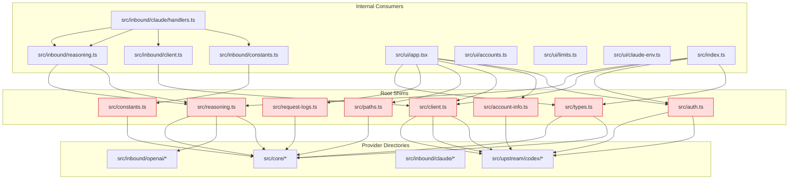
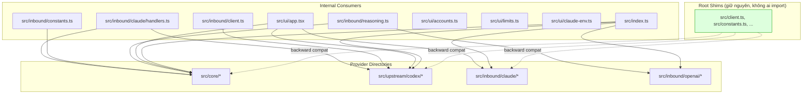

# Design Document: Consolidate Root Shims

## Overview

Feature này tái cấu trúc import graph của dự án codex2claudecode bằng cách cập nhật tất cả internal consumer để import trực tiếp từ Provider_Directory (`src/core/`, `src/upstream/codex/`, `src/inbound/claude/`, `src/inbound/openai/`) thay vì đi qua các root-level shim file. Đồng thời, file có logic thực (`claude-code-env.config.ts`) được di chuyển vào đúng thư mục kiến trúc, với shim tại vị trí cũ để đảm bảo backward compatibility.

**Nguyên tắc cốt lõi:** Không xóa bất kỳ shim nào. Tất cả shim file (12 root shim, 10 legacy claude shim, 3 inbound shim) vẫn tồn tại tại vị trí cũ với export surface không đổi. Backward compatibility baseline (`test/backward-compat-baseline.json`) không bị thay đổi.

### Phạm vi thay đổi

- **Cập nhật import path:** ~8 file internal consumer (3 inbound shim, 1 handler, ~3 UI file, 1 barrel)
- **Di chuyển file:** 1 file (`src/claude-code-env.config.ts` → `src/inbound/claude/`)
- **Không thay đổi:** Tất cả shim file, backward compat baseline, test suite

## Architecture

### Kiến trúc hiện tại — Import qua shim



### Kiến trúc sau consolidation — Import trực tiếp



### Quyết định thiết kế

1. **Giữ nguyên tất cả shim:** Shim file trở thành "dead code" trong internal graph nhưng vẫn cần thiết cho external consumer và backward compatibility. Chi phí duy trì thấp (chỉ là re-export), lợi ích backward compat cao.

2. **Inbound shim cập nhật nguồn, không xóa:** `src/inbound/client.ts`, `src/inbound/constants.ts`, `src/inbound/reasoning.ts` hiện import ngược qua root shim. Cập nhật chúng để import trực tiếp từ provider directory, nhưng giữ file tại vị trí cũ vì chúng có thể được import bởi code khác.

3. **Di chuyển claude-code-env.config.ts:** File này chứa logic thực (config object, type definitions) và thuộc về inbound/claude domain. Di chuyển vào `src/inbound/claude/` và tạo shim tại vị trí cũ.

4. **Giữ nguyên composition root files:** `bootstrap.ts`, `runtime.ts`, `bin.ts`, `cli.ts`, `package-info.ts` là cross-cutting concerns, không thuộc một provider directory cụ thể nào.

## Components and Interfaces

### Danh sách file cần thay đổi

#### Nhóm 1: Inbound Shim — Cập nhật import source

| File | Hiện tại | Sau consolidation |
|------|----------|-------------------|
| `src/inbound/client.ts` | `export { CodexStandaloneClient } from "../client"` | `export { CodexStandaloneClient } from "../upstream/codex/client"` |
| `src/inbound/constants.ts` | `export { LOG_BODY_PREVIEW_LIMIT } from "../constants"` | `export { LOG_BODY_PREVIEW_LIMIT } from "../core/constants"` |
| `src/inbound/reasoning.ts` | `export { normalizeReasoningBody, normalizeRequestBody } from "../reasoning"` | `export { normalizeReasoningBody } from "../core/reasoning"` + `export { normalizeRequestBody } from "./openai/normalize"` |

#### Nhóm 2: Handler — Cập nhật import path

| File | Import hiện tại | Import sau consolidation |
|------|----------------|--------------------------|
| `src/inbound/claude/handlers.ts` | `from "../constants"` | `from "../../core/constants"` |
| | `from "../client"` | `from "../../upstream/codex/client"` |
| | `from "../reasoning"` | `from "../../core/reasoning"` |
| | `from "../types"` (giữ nguyên) | `from "../types"` (đây là `src/inbound/types.ts`, không phải root shim) |

#### Nhóm 3: UI files — Cập nhật import path

| File | Import hiện tại | Import sau consolidation |
|------|----------------|--------------------------|
| `src/ui/app.tsx` | `from "../account-info"` | `from "../upstream/codex/account-info"` |
| | `from "../auth"` | `from "../upstream/codex/auth"` |
| | `from "../client"` | `from "../upstream/codex/client"` |
| | `from "../connect-account"` | `from "../upstream/codex/connect-account"` |
| | `from "../paths"` | `from "../core/paths"` |
| | `from "../request-logs"` | `from "../core/request-logs"` |
| | `from "../types"` | `from "../core/types"` + `from "../upstream/codex/types"` |
| | `from "../runtime"` (giữ nguyên) | `from "../runtime"` (file logic, không phải shim) |
| | `from "../package-info"` (giữ nguyên) | `from "../package-info"` (file logic) |
| | `from "../cli"` (giữ nguyên) | `from "../cli"` (file logic) |
| `src/ui/accounts.ts` | `from "../auth"` | `from "../upstream/codex/auth"` |
| | `from "../account-info"` | `from "../upstream/codex/account-info"` |
| | `from "../types"` | `from "../upstream/codex/types"` + `from "../core/types"` (nếu cần) |
| `src/ui/limits.ts` | `from "../account-info"` | `from "../upstream/codex/account-info"` |
| `src/ui/claude-env.ts` | `from "../claude-code-env.config"` | `from "../inbound/claude/claude-code-env.config"` |
| | `from "../paths"` | `from "../core/paths"` |

#### Nhóm 4: Public API Barrel — Cập nhật re-export source

`src/index.ts` hiện re-export qua root shim. Sau consolidation:

```typescript
// Trước
export * from "./types"
export * from "./account-info"
export * from "./auth"
export * from "./client"
export * from "./reasoning"

// Sau — explicit re-export từ provider directories
export type { HealthStatus, JsonObject, RequestLogEntry, RequestOptions, RequestProxyLog, RuntimeOptions, SseEvent } from "./core/types"
export type { AuthFileContent, AuthFileData, ChatCompletionRequest, CodexClientOptions, CodexClientTokens, ResponsesRequest, TokenResponse } from "./upstream/codex/types"
export type { ClaudeFunctionTool, ClaudeMcpServer, ClaudeMcpToolset, ClaudeMessagesRequest, ClaudeTool } from "./inbound/claude/types"
export * from "./cli"
export * from "./upstream/codex/account-info"
export * from "./package-info"
export * from "./upstream/codex/auth"
export { CodexStandaloneClient } from "./upstream/codex/client"
export { normalizeReasoningBody } from "./core/reasoning"
export { normalizeRequestBody } from "./inbound/openai/normalize"
export * from "./runtime"
```

**Lưu ý quan trọng:** `src/types.ts` hiện dùng `export type { ... }` với danh sách cụ thể. Khi cập nhật `src/index.ts`, phải dùng cùng pattern — KHÔNG dùng `export *` từ `./core/types` vì module đó có thể export thêm symbol không thuộc public API.

#### Nhóm 5: File di chuyển

| Hành động | Chi tiết |
|-----------|---------|
| Di chuyển | `src/claude-code-env.config.ts` → `src/inbound/claude/claude-code-env.config.ts` |
| Tạo shim | `src/claude-code-env.config.ts` re-export: `CLAUDE_CODE_ENV_CONFIG`, `ClaudeCodeEditableEnvKey`, `ClaudeCodeLockedEnvKey` |
| Cập nhật import trong file mới | `from "./models"` thay vì `from "./models"` (giữ nguyên vì `src/inbound/claude/models.ts` tồn tại) |

### File KHÔNG thay đổi

- **12 Root Shim:** `account-info.ts`, `auth.ts`, `client.ts`, `codex-auth.ts`, `connect-account.ts`, `constants.ts`, `http.ts`, `models.ts`, `paths.ts`, `reasoning.ts`, `request-logs.ts`, `types.ts`
- **10 Legacy Claude Shim:** Tất cả file trong `src/claude/`
- **Composition root:** `bootstrap.ts`, `runtime.ts`, `bin.ts`, `cli.ts`, `package-info.ts`
- **`src/claude.ts`:** Đã là shim, giữ nguyên
- **Backward compat baseline:** `test/backward-compat-baseline.json`
- **Tất cả test file**

## Data Models

Feature này không thay đổi data model. Tất cả type definitions giữ nguyên tại vị trí hiện tại trong provider directories:

- `src/core/types.ts` — `JsonObject`, `RequestOptions`, `RequestProxyLog`, `RequestLogEntry`, `RuntimeOptions`, `HealthStatus`, `SseEvent`
- `src/upstream/codex/types.ts` — `AuthFileContent`, `AuthFileData`, `CodexClientOptions`, `CodexClientTokens`, `TokenResponse`, `ResponsesRequest`, `ChatCompletionRequest`
- `src/inbound/claude/types.ts` — `ClaudeMessagesRequest`, `ClaudeTool`, `ClaudeFunctionTool`, `ClaudeMcpToolset`, `ClaudeMcpServer`

Shim `src/types.ts` tiếp tục re-export subset cụ thể từ 3 nguồn trên bằng `export type { ... }`.

## Correctness Properties

*A property is a characteristic or behavior that should hold true across all valid executions of a system — essentially, a formal statement about what the system should do. Properties serve as the bridge between human-readable specifications and machine-verifiable correctness guarantees.*

### Property 1: No internal consumer imports from shim paths

*For any* TypeScript source file in the project that is classified as an internal consumer (i.e., not a shim file itself and not a test file), none of its import or export-from statements shall reference a root shim module path (`src/account-info`, `src/auth`, `src/client`, `src/codex-auth`, `src/connect-account`, `src/constants`, `src/http`, `src/models`, `src/paths`, `src/reasoning`, `src/request-logs`, `src/types`).

**Validates: Requirements 1.1, 1.6, 1.7, 5.4**

### Property 2: All shim export surfaces preserved

*For any* shim file listed in the backward compatibility baseline (12 root shims + 10 legacy claude shims + `src/claude.ts`), the set of exported symbol names shall be exactly equal to the set recorded in `test/backward-compat-baseline.json` — no symbols added, no symbols removed.

**Validates: Requirements 3.1, 3.2, 3.3, 3.4, 3.5, 3.6, 3.7, 2.4**

### Property 3: All baseline modules remain importable with correct exports

*For any* module entry in `test/backward-compat-baseline.json`, dynamically importing the file at `module.file` shall succeed, and the imported module shall contain all symbols listed in `module.exports`.

**Validates: Requirements 4.1, 4.3, 4.4, 5.1, 5.2**

## Error Handling

Feature này là refactoring thuần túy — không thay đổi runtime behavior hay error handling logic. Các error scenario cần lưu ý trong quá trình thực hiện:

1. **Import resolution failure:** Nếu một import path được cập nhật sai, TypeScript compiler sẽ báo lỗi. Giải pháp: chạy `bun run build` sau mỗi nhóm thay đổi.

2. **Export surface mismatch:** Nếu shim tại vị trí cũ export thiếu hoặc thừa symbol so với baseline. Giải pháp: dùng `export type { ... }` hoặc `export { ... }` với danh sách cụ thể thay vì `export *` khi module nguồn export nhiều hơn shim gốc.

3. **Circular dependency:** Cập nhật import path có thể vô tình tạo circular dependency. Giải pháp: import trực tiếp từ provider directory (leaf module) thay vì qua barrel/index file.

4. **Type-only export bị mất:** Khi chuyển từ `export *` sang explicit export, type-only export có thể bị bỏ sót. Giải pháp: so sánh export surface trước và sau bằng `test/export-surface.ts` utility.

## Testing Strategy

### Approach

Feature này là refactoring không thay đổi runtime behavior, nên testing tập trung vào:

1. **Backward compatibility test** (đã có): `test/backward-compat.test.ts` kiểm tra tất cả module path trong baseline vẫn importable với đúng export surface.
2. **Build verification:** `bun run build` phải thành công.
3. **Full test suite:** `bun run test` phải pass với 0 failure (84+ tests).
4. **Property-based test:** Kiểm tra import graph không còn tham chiếu đến root shim.

### Property-Based Testing

Sử dụng thư viện `fast-check` cho property-based testing. Mỗi property test chạy tối thiểu 100 iterations.

**Property test 1:** Chọn ngẫu nhiên một internal consumer file, parse import statements, verify không có import nào trỏ đến root shim path.
- Tag: **Feature: consolidate-root-shims, Property 1: No internal consumer imports from shim paths**

**Property test 2:** Chọn ngẫu nhiên một shim file từ baseline, extract export names, verify khớp chính xác với baseline.
- Tag: **Feature: consolidate-root-shims, Property 2: All shim export surfaces preserved**

**Property test 3:** Chọn ngẫu nhiên một module entry từ baseline, dynamic import file, verify tất cả expected exports có mặt.
- Tag: **Feature: consolidate-root-shims, Property 3: All baseline modules remain importable with correct exports**

### Unit Tests

- Verify `src/inbound/client.ts` imports from `../upstream/codex/client`
- Verify `src/inbound/constants.ts` imports from `../core/constants`
- Verify `src/inbound/reasoning.ts` imports from `../core/reasoning` và `./openai/normalize`
- Verify `src/claude-code-env.config.ts` (shim) re-exports đúng 3 symbols
- Verify `src/inbound/claude/claude-code-env.config.ts` (logic) tồn tại và export đúng symbols

### Integration Tests

- `bun run build` thành công
- `bun run test` pass (84+ tests, 0 failure)
- `bun test test/backward-compat.test.ts` pass
- `bun test test/core/ test/inbound/ test/upstream/` pass

### Thứ tự thực hiện an toàn

1. Di chuyển `claude-code-env.config.ts` → tạo shim → verify build
2. Cập nhật 3 inbound shim → verify build
3. Cập nhật `src/inbound/claude/handlers.ts` → verify build
4. Cập nhật UI files → verify build
5. Cập nhật `src/index.ts` → verify build + verify export surface
6. Chạy full test suite
