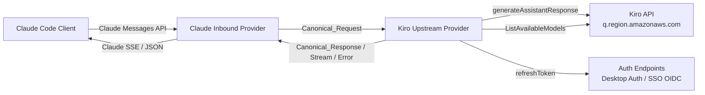
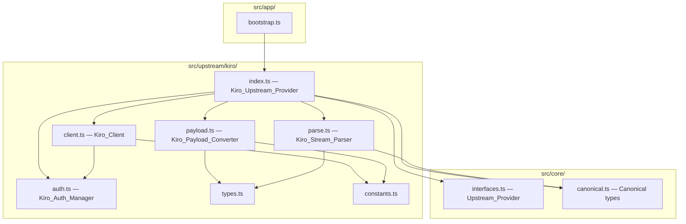
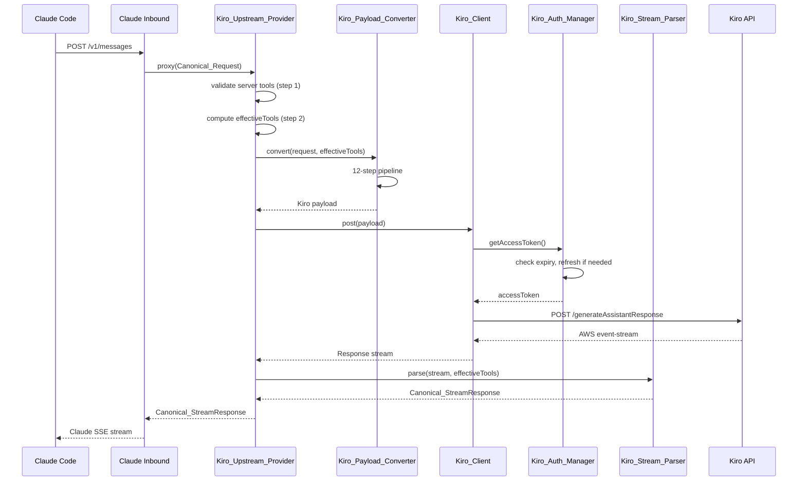
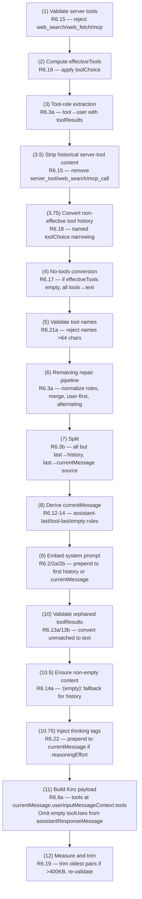

# Design Document: Kiro Upstream Provider

## Overview

The Kiro upstream provider enables the codex2claudecode project to route requests through the Kiro API (Amazon Q Developer) as an alternative to the existing Codex upstream provider. It implements the `Upstream_Provider` interface from `src/core/interfaces.ts`, translating `Canonical_Request` objects into the Kiro `generateAssistantResponse` wire format, parsing the AWS event-stream binary response back into canonical types, and managing authentication via the local Kiro IDE SSO cache.

Phase 1 supports only the Claude inbound provider. The OpenAI inbound provider is excluded because Kiro never returns passthrough responses and the OpenAI inbound provider only handles `Canonical_PassthroughResponse` and `Canonical_ErrorResponse`.

### Design Decisions and Rationale

1. **File structure mirrors Codex provider** — `src/upstream/kiro/` with the same file-per-responsibility split (index, client, auth, payload, parse, types, constants) to maintain architectural consistency and satisfy the provider architecture coding rules.

2. **12-step payload conversion pipeline** — The Kiro API has strict payload constraints (alternating roles, no empty content, tool results must match tool calls, 400KB limit). A fixed-order pipeline ensures each constraint is addressed in the correct sequence, with each step's preconditions guaranteed by prior steps.

3. **effectiveTools owned by provider, not converter** — The `Kiro_Upstream_Provider` computes `effectiveTools` because it requires cross-cutting knowledge (server tool validation, toolChoice semantics) that spans both payload conversion and response parsing. The converter receives `effectiveTools` as a parameter.

4. **AWS event-stream binary parsing** — The Kiro API uses a binary framing format with JSON payloads delimited by `:message-type` markers, not standard SSE. A custom `AwsEventStreamParser` class buffers incomplete chunks and extracts JSON events by pattern matching.

5. **Bootstrap wiring via UPSTREAM_PROVIDER env var** — Provider selection happens entirely in `bootstrap.ts` with no changes to `runtime.ts`, following the existing architecture where the runtime only knows about core interfaces.

6. **Dual auth type detection at init** — Auth type (Desktop Auth vs SSO OIDC) is determined once during initialization based on credential availability, then used for all subsequent refreshes. This avoids per-request auth type decisions and matches the kiro-gateway reference implementation.

7. **Canonical response enforcement** — The Kiro wire format (AWS event-stream with Kiro-specific JSON events) is incompatible with any inbound provider's native format. The provider always parses responses into canonical types, ignoring the `passthrough` flag. `Canonical_PassthroughResponse` is never returned.

8. **textFormat rejection** — The Kiro API does not support structured output / JSON schema constraints. Requests with `textFormat` set will receive a 400 error rather than silently ignoring the field, preventing behavior differences between Codex and Kiro upstream providers.

## Architecture

### System Context



### Module Architecture



### Request Flow



## Components and Interfaces

### File Structure

```
src/upstream/kiro/
  index.ts      — Kiro_Upstream_Provider class (Upstream_Provider impl)
  client.ts     — Kiro_Client (HTTP, retry, headers)
  auth.ts       — Kiro_Auth_Manager (credential lifecycle)
  payload.ts    — Kiro_Payload_Converter (Canonical_Request → Kiro wire)
  parse.ts      — Kiro_Stream_Parser (Kiro wire → canonical events)
  types.ts      — Kiro-specific TypeScript types
  constants.ts  — Endpoints, thresholds, header patterns
```

### `constants.ts` — Provider Constants

```typescript
// Auth endpoints
export const KIRO_AUTH_TOKEN_PATH = "~/.aws/sso/cache/kiro-auth-token.json"
export const KIRO_DESKTOP_REFRESH_TEMPLATE = "https://prod.{region}.auth.desktop.kiro.dev/refreshToken"
export const SSO_OIDC_ENDPOINT_TEMPLATE = "https://oidc.{region}.amazonaws.com/token"

// API endpoints
export const KIRO_API_HOST_TEMPLATE = "https://q.{region}.amazonaws.com"
export const GENERATE_ASSISTANT_RESPONSE_PATH = "/generateAssistantResponse"
export const LIST_AVAILABLE_MODELS_PATH = "/ListAvailableModels"

// Timeouts and thresholds
export const TOKEN_REFRESH_THRESHOLD_SECONDS = 600
export const STREAMING_READ_TIMEOUT_MS = 300_000
export const MAX_RETRIES = 3
export const BASE_RETRY_DELAY_MS = 1000
export const PAYLOAD_SIZE_LIMIT_BYTES = 400_000
export const TOOL_DESCRIPTION_MAX_LENGTH = 10_000
export const TOOL_NAME_MAX_LENGTH = 64
export const MODEL_CACHE_TTL_SECONDS = 3600
export const DEFAULT_MAX_INPUT_TOKENS = 200_000

// Thinking tag budgets
export const REASONING_EFFORT_BUDGETS: Record<string, number> = {
  low: 4000,
  medium: 8000,
  high: 16000,
  xhigh: 32000,
}

// Header patterns
export const USER_AGENT_TEMPLATE =
  "aws-sdk-js/1.0.27 ua/2.1 os/{platform}#{version} lang/js md/nodejs#{nodeVersion} api/codewhispererstreaming#1.0.27 m/E KiroIDE-{kiroVersion}-{fingerprint}"
export const X_AMZ_USER_AGENT_TEMPLATE = "aws-sdk-js/1.0.27 KiroIDE-{kiroVersion}-{fingerprint}"

// App state
export const KIRO_STATE_FILE_NAME = "kiro-state.json"
```

### `types.ts` — Kiro Wire Types

```typescript
// Auth types
export type KiroAuthType = "kiro_desktop" | "aws_sso_oidc"

export interface KiroAuthTokenFile {
  accessToken: string
  refreshToken: string
  expiresAt: string
  region: string
  clientIdHash?: string
  clientId?: string
  clientSecret?: string
  profileArn?: string
}

export interface KiroDeviceRegistrationFile {
  clientId: string
  clientSecret: string
}

export interface KiroRefreshResponse {
  accessToken: string
  refreshToken: string
  expiresIn: number
  profileArn?: string  // Desktop Auth only
}

export interface SsoOidcRefreshResponse {
  accessToken: string
  refreshToken: string
  expiresIn: number
}

// Kiro API payload types
export interface KiroConversationState {
  conversationId: string
  currentMessage: KiroCurrentMessage
  chatTriggerType: "MANUAL"
  history?: KiroHistoryEntry[]
}

export interface KiroCurrentMessage {
  userInputMessage: KiroUserInputMessage
}

export interface KiroUserInputMessage {
  content: string
  modelId: string
  origin: "AI_EDITOR"
  userInputMessageContext?: KiroUserInputMessageContext
  images?: KiroImage[]
}

export interface KiroUserInputMessageContext {
  toolResults?: KiroToolResult[]
  tools?: KiroToolSpecification[]
}

export interface KiroAssistantResponseMessage {
  content: string
  toolUses?: KiroToolUse[]
}

export type KiroHistoryEntry =
  | { userInputMessage: KiroUserInputMessage }
  | { assistantResponseMessage: KiroAssistantResponseMessage }

export interface KiroToolSpecification {
  toolSpecification: {
    name: string
    description: string
    inputSchema: { json: Record<string, unknown> }
  }
}

export interface KiroToolUse {
  toolUseId: string
  name: string
  input: Record<string, unknown>
}

export interface KiroToolResult {
  toolUseId: string
  content: Array<{ text: string }>
  status: "success"
}

export interface KiroImage {
  format: string
  source: { bytes: string }
}

export interface KiroGeneratePayload {
  conversationState: KiroConversationState
  profileArn?: string
}

// Parser types
export interface KiroContentEvent {
  content: string
  followupPrompt?: string
}

export interface KiroToolStartEvent {
  name: string
  toolUseId: string
  input: string | Record<string, unknown>  // string appended as-is; object serialized via JSON.stringify()
  stop?: boolean
}

export interface KiroToolInputEvent {
  input: string | Record<string, unknown>  // string appended as-is; object serialized via JSON.stringify()
}

export interface KiroToolStopEvent {
  stop: boolean
}

export interface KiroUsageEvent {
  usage: number
}

export interface KiroContextUsageEvent {
  contextUsagePercentage: number
}

// Error types
export class ToolNameTooLongError extends Error {
  constructor(message: string) { super(message); this.name = "ToolNameTooLongError" }
}

export class PayloadTooLargeError extends Error {
  constructor(message: string) { super(message); this.name = "PayloadTooLargeError" }
}

// HTTP error thrown by Kiro_Client for ALL non-OK responses:
// - Non-retryable (400, 401, etc.): thrown immediately
// - Retryable (403, 429, 5xx): thrown when retries are exhausted
export class KiroHttpError extends Error {
  readonly status: number
  readonly headers: Headers
  readonly body: string
  constructor(status: number, headers: Headers, body: string) {
    super(`Kiro API error: ${status}`)
    this.name = "KiroHttpError"
    this.status = status
    this.headers = headers
    this.body = body
  }
}

// Network error thrown by Kiro_Client for non-HTTP failures
// (timeouts, DNS failures, connection refused, TypeError from fetch)
// Note: AbortError from caller-initiated abort (options.signal.aborted === true)
// is NOT wrapped — it is re-thrown as-is. In the pre-stream phase, it propagates
// through proxy() to the inbound provider's handle(), which returns a 500 error
// response (acceptable because the client has already disconnected). During
// streaming, the inbound's onCancel handler tears down the stream gracefully.
export class KiroNetworkError extends Error {
  constructor(message: string) {
    super(message)
    this.name = "KiroNetworkError"
  }
}
```

### `auth.ts` — Kiro_Auth_Manager

Responsible for reading, validating, and refreshing Kiro authentication tokens.

```typescript
export class Kiro_Auth_Manager {
  // Private state
  private accessToken: string
  private refreshToken: string
  private expiresAt: Date | undefined
  private region: string
  private profileArn?: string
  private clientId?: string
  private clientSecret?: string
  private authType: KiroAuthType
  private refreshPromise?: Promise<void>
  private readonly authFilePath: string
  private readonly fetchFn: typeof fetch
  private readonly fingerprint: string

  // Construction
  static async fromAuthFile(path?: string, options?: { fetch?: typeof fetch }): Promise<Kiro_Auth_Manager>

  // Public API
  async getAccessToken(): Promise<string>  // Proactive refresh if expiring soon
  isTokenExpiringSoon(): boolean           // Within 600s of expiresAt
  isTokenExpired(): boolean                // Past expiresAt
  getRegion(): string
  getProfileArn(): string | undefined
  getAuthType(): KiroAuthType

  // Private
  private async refresh(): Promise<void>
  private async refreshDesktopAuth(): Promise<void>
  private async refreshSsoOidc(): Promise<void>
  private async writeBackCredentials(): Promise<void>
  private detectAuthType(): void
}
```

**Auth type detection logic (R3 criteria 1-2):**
1. Read Auth_Token_File at specified path (default `~/.aws/sso/cache/kiro-auth-token.json`)
2. If `clientIdHash` present, read Device_Registration_File at `~/.aws/sso/cache/{clientIdHash}.json`
3. Direct Auth_Token_File `clientId`/`clientSecret` override Device_Registration_File credentials when both are present (matching the reference gateway load order: companion file is loaded first, then direct fields overwrite)
4. If `clientId` AND `clientSecret` available from either source → `aws_sso_oidc`
5. Otherwise → `kiro_desktop`

**Refresh flow:**
- Desktop Auth: POST to `https://prod.{region}.auth.desktop.kiro.dev/refreshToken` with `{"refreshToken": "..."}` and `User-Agent: KiroIDE-{version}-{fingerprint}`
- SSO OIDC: POST to `https://oidc.{region}.amazonaws.com/token` with `{"grantType": "refresh_token", "clientId": "...", "clientSecret": "...", "refreshToken": "..."}`
- Both: update stored `accessToken`, `refreshToken`, and compute `expiresAt = new Date(Date.now() + expiresIn * 1000).toISOString()`
- Desktop Auth only: if the refresh response contains `profileArn`, update the stored `profileArn` value before write-back
- Write back to Auth_Token_File preserving all existing fields (only refreshed fields are overwritten)
- Concurrent refresh prevention via pending promise reuse

**Design-phase note (corrupt companion file):** If the Device_Registration_File exists but contains invalid JSON, missing fields, or is unreadable, the auth manager logs a warning and proceeds without OIDC credentials (falls back to Desktop Auth), consistent with the missing-file behavior.

### `client.ts` — Kiro_Client

HTTP client with retry logic, token refresh, and header construction.

```typescript
export class Kiro_Client {
  constructor(auth: Kiro_Auth_Manager, options?: { fetch?: typeof fetch })

  // Main API call
  async generateAssistantResponse(
    payload: KiroGeneratePayload,
    options?: { signal?: AbortSignal; stream?: boolean }
  ): Promise<Response>

  // Model listing
  async listAvailableModels(): Promise<string[]>

  // Health check
  async checkHealth(timeoutMs: number): Promise<HealthStatus>
}
```

**Headers (R4):** Every request includes:
- `Authorization: Bearer {accessToken}`
- `Content-Type: application/json`
- `x-amzn-codewhisperer-optout: true`
- `User-Agent: aws-sdk-js/1.0.27 ua/2.1 os/{platform}#{version} lang/js md/nodejs#{nodeVersion} api/codewhispererstreaming#1.0.27 m/E KiroIDE-{kiroVersion}-{fingerprint}`
- `x-amz-user-agent: aws-sdk-js/1.0.27 KiroIDE-{kiroVersion}-{fingerprint}`
- `x-amzn-kiro-agent-mode: vibe`
- `amz-sdk-invocation-id: {uuid-v4}`
- `amz-sdk-request: attempt=1; max=3`

**Retry logic (R5):**
- Non-retryable non-OK (400, 401, etc.) → throw `KiroHttpError` immediately
- 403 → refresh token, retry once; if still fails → throw `KiroHttpError`
- 429 → exponential backoff (1s, 2s, 4s), up to 3 retries
- 5xx → exponential backoff, up to 3 retries
- Exhausted retryable → throw `KiroHttpError` (with `status`, `headers`, `body`) to the caller. The `Kiro_Upstream_Provider` catches `KiroHttpError` and maps it to `Canonical_ErrorResponse`.
- Fetch errors (AbortError, TypeError, DNS failure, connection refused) → caller-abort vs internal-error distinction (see below). The `Kiro_Upstream_Provider` catches `KiroNetworkError` and maps it to `Canonical_ErrorResponse` with status 504.
- Read timeout: 300s for streaming
- Proactive token refresh before every request via `auth.getAccessToken()`

**Error boundary:** `generateAssistantResponse()` returns `Promise<Response>` ONLY for successful (2xx) responses. For ALL non-OK responses, it throws `KiroHttpError`:
- Non-retryable non-OK responses (400, 401, etc.) → throws `KiroHttpError` immediately (no retry)
- Retryable responses (403 → refresh + retry once; 429, 5xx → exponential backoff up to 3 retries) → throws `KiroHttpError` when retries are exhausted

This ensures the parser (`streamKiroResponse`/`collectKiroResponse`) only ever receives successful responses and never attempts to parse error JSON as AWS event-stream. The `Kiro_Upstream_Provider` is responsible for catching `KiroHttpError` and mapping it to `Canonical_ErrorResponse`. For non-HTTP errors (timeouts, DNS failures, connection refused), the client catches fetch exceptions and wraps them as `KiroNetworkError` (see types.ts). This keeps the client as a pure HTTP layer and the provider as the canonical-type boundary.

**Caller-abort vs internal-error distinction:** `generateAssistantResponse()` receives `options.signal` from the caller (the Claude inbound provider's request signal). When a fetch throws an `AbortError`, the client MUST distinguish between two cases:
- **Caller-initiated abort** (`options.signal?.aborted === true`): The client disconnected, causing the caller's signal to abort the in-flight fetch. In this case, the client re-throws the original `AbortError` without wrapping it as `KiroNetworkError`. The `Kiro_Upstream_Provider.proxy()` does NOT catch `AbortError` — it lets the error propagate to the Claude inbound provider's `handle()` method, which catches all errors from `upstream.proxy()` and returns a `claudeErrorResponse` with status 500. **This is acceptable behavior for the pre-stream phase** (before response headers are sent) because the client has already disconnected and will never see the 500 response. The important abort case is during streaming, where the Claude inbound provider's `onCancel` handler already handles client disconnects gracefully by cleaning up the stream. This is consistent with how the Codex upstream handles aborts.
- **Internal timeout or network error** (`options.signal?.aborted === false`, or no signal provided): The abort was caused by an internal read timeout, DNS failure, or other network issue. In this case, the client wraps the error as `KiroNetworkError` → the provider maps it to `Canonical_ErrorResponse` with status 504.

This prevents client disconnects from being misclassified as upstream timeouts (504) in logs and error responses. The two abort phases are:
- **Pre-stream (before response headers):** AbortError propagates through `proxy()` → caught by inbound `handle()` → 500 error response (client already gone, response is discarded).
- **During streaming (after response headers):** The inbound provider's `onCancel` callback fires → cleans up the stream reader → no error response needed.

**ListAvailableModels (R12):** GET to `https://q.{region}.amazonaws.com/ListAvailableModels?origin=AI_EDITOR` with optional `profileArn` query param (Desktop Auth only, not SSO OIDC).

### `payload.ts` — Kiro_Payload_Converter

Converts `Canonical_Request` into the Kiro `generateAssistantResponse` wire format.

```typescript
export function convertCanonicalToKiroPayload(
  request: Canonical_Request,
  effectiveTools: JsonObject[],
  options: {
    modelId: string
    authType: KiroAuthType
    profileArn?: string
    instructions?: string
  }
): KiroGeneratePayload
```

**12-Step Processing Pipeline (R6 criterion 3):**



Steps 1-2 are owned by `Kiro_Upstream_Provider` (in `index.ts`). Steps 3-12 are owned by `Kiro_Payload_Converter` (in `payload.ts`), which receives `effectiveTools` as input.

**Key conversion rules:**
- Tool-role messages (role `tool`) → user messages with `toolResults` in Kiro wire shape: `{ toolUseId, content: [{ text }], status: "success" }`
- Empty tool output → `"(empty result)"`
- `function_call` content items → `toolUse` with `input` parsed from `arguments`
- Function tools → `toolSpecification` with `inputSchema: { json: sanitizedSchema }`
- Schema read from `parameters` field, fallback to `input_schema`, then `{ type: "object", properties: {} }`
- Tools placed at `conversationState.currentMessage.userInputMessage.userInputMessageContext.tools`
- `profileArn` included as top-level field only for Desktop Auth
- `conversationId` is a random UUID v4 per request
- Tool descriptions >10000 chars → moved to system prompt with reference string
- Empty `required` arrays and `additionalProperties` fields removed from schemas
- Empty tool descriptions → `"Tool: {name}"` placeholder
- `input_image` with data URL → `{ format, source: { bytes } }` in `userInputMessage.images`
- URL-based images → text placeholder
- `input_file` with text data URL → decoded text in content
- `input_file` with binary/URL/file_id → text placeholder with warning

**Empty `toolUses` omission (step 11):** When building the Kiro payload, the `toolUses` field SHALL be omitted from `assistantResponseMessage` when the array is empty. Kiro may reject empty arrays, and the reference gateway strips them. Only include `toolUses` when the assistant message contains one or more tool calls.

**Named toolChoice conversion (R6.18, step 3.75):** When `toolChoice` names a specific tool, `effectiveTools` is narrowed to that single tool. Historical `toolUses` and `toolResults` for tools NOT in `effectiveTools` are converted to text representation. This conversion applies to the ENTIRE pre-split message array (not just post-split history), ensuring the `currentMessage` source is also cleaned.

**Payload trimming (R6.19, step 12):** Trim-and-revalidate loop:
1. Measure serialized JSON size
2. If >400KB: trim oldest user+assistant pair from history
3. Re-run orphaned toolResults validation
4. Re-embed system prompt into new first message
5. Re-measure final payload size
6. Repeat until fits or history exhausted
7. If still too large → `PayloadTooLargeError` → 413 response

### `parse.ts` — Kiro_Stream_Parser

Parses the Kiro AWS event-stream binary response into canonical types.

```typescript
// Streaming
export function streamKiroResponse(
  response: Response,
  fallbackModel: string,
  effectiveTools: JsonObject[],
  inputTokenEstimate: number
): Canonical_StreamResponse

// Non-streaming (collected)
export async function collectKiroResponse(
  response: Response,
  fallbackModel: string,
  effectiveTools: JsonObject[],
  inputTokenEstimate: number
): Promise<Canonical_Response>

// Internal: AWS event-stream binary parser
export class AwsEventStreamParser {
  feed(chunk: Uint8Array): KiroParsedEvent[]
  getToolCalls(): KiroToolCall[]
  reset(): void
}

// Internal: Thinking block extractor
export class ThinkingBlockExtractor {
  feed(content: string): { thinking?: string; regular?: string }
  finalize(): { thinking?: string; regular?: string }
}
```

**AWS Event-Stream Parsing (R7):**
- Binary chunks decoded to UTF-8, buffered for incomplete JSON
- JSON events detected by pattern matching: `{"content":`, `{"name":`, `{"input":`, `{"stop":`, `{"usage":`, `{"contextUsagePercentage":`
- Nested brace matching for correct JSON boundary detection
- Content deduplication (consecutive identical content events)
- Tool call accumulation: `name`+`toolUseId` starts a call, `input` appends, `stop` finalizes

**Tool call input accumulation and serialization:** Parser event types allow `input` to be `string | Record<string, unknown>`. During tool call accumulation, the parser maintains TWO accumulators per in-progress tool call: a **string buffer** (for string chunks) and an **object accumulator** (for object chunks):
- **String input chunks:** append as-is to the string buffer.
- **Object input chunks:** deep-merge into the object accumulator via `Object.assign()` / spread. This correctly handles the case where Kiro sends `{"a":1}` then `{"b":2}` — the object accumulator becomes `{"a":1,"b":2}` instead of the invalid `{"a":1}{"b":2}` that naive string concatenation would produce.
- **Finalization (stop event):** if the string buffer is non-empty, use it as the arguments string (it is already JSON from the API). If the string buffer is empty but the object accumulator has keys, serialize the object accumulator via `JSON.stringify()`. If both are empty, use `"{}"` as fallback. The final arguments string MUST be valid JSON; if not, use `"{}"` as fallback.
- The `tool_call_done` canonical event's `arguments` field is always a JSON string, never an object.

In practice, Kiro typically sends either all string chunks OR a single object — mixed mode (string chunks interleaved with object chunks) is rare. The dual-accumulator handles both cases correctly without data loss.

**Streaming Events (R8):**
- `content` → `text_delta` canonical event
- Finalized tool call → `tool_call_done` canonical event
- Stream end → `message_stop` with stop reason (`end_turn`, `tool_use`, `max_tokens`)
- `usage` → `usage` canonical event
- `contextUsagePercentage` → used for input token estimation

**Thinking Block Extraction (R10):**
- Buffer initial 30 characters to detect `<thinking>` or `<think>` tags
- Extract content between opening and closing tags as thinking content
- Yield: `content_block_start(thinking)` → `thinking_delta` events → `thinking_signature(sig_{uuid_hex})` → `content_block_stop`
- All content after closing tag treated as regular text

**Bracket-Style Tool Call Parsing (R20):**
- Non-streaming only (full text available before response construction)
- Pattern: `[Called {function_name} with args: {json}]`
- Only extract when function name exists in `effectiveTools` AND JSON parses successfully
- Deduplicate against structured tool calls (prefer non-empty arguments)
- Extracted calls become `Canonical_ToolCallBlock` with `id: fc_{uuid}`, `callId: toolu_{uuid}`
- Content array preserves original text order with bracket patterns removed

**Token Count Estimation (R13):**
- Output tokens: local tokenizer (gpt-tokenizer) on response text
- Input tokens from `contextUsagePercentage`: `(percentage / 100) * maxInputTokens - outputTokens`, clamped to 0
- Default `maxInputTokens`: 200000
- Fallback: when `contextUsagePercentage` is absent, use the pre-computed `inputTokenEstimate` passed in by the `Kiro_Upstream_Provider` (estimated from the original request messages using gpt-tokenizer before calling the parser)

**Stop Reason (R9 criterion 4):** When `Canonical_Response.content` contains any `Canonical_ToolCallBlock`, `stopReason` is set to `tool_use` regardless of how the tool calls were detected (structured events or bracket extraction).

### `index.ts` — Kiro_Upstream_Provider

Top-level provider class orchestrating all modules.

```typescript
export class Kiro_Upstream_Provider implements Upstream_Provider {
  private readonly auth: Kiro_Auth_Manager
  private readonly client: Kiro_Client
  private modelCache?: { models: string[]; cachedAt: number }

  static async fromAuthFile(path?: string, options?: { fetch?: typeof fetch }): Promise<Kiro_Upstream_Provider>

  // Upstream_Provider interface
  async proxy(request: Canonical_Request, options?: RequestOptions): Promise<UpstreamResult>
  async checkHealth(timeoutMs: number): Promise<HealthStatus>

  // Model listing (injected into Claude_Inbound_Provider as modelResolver)
  async listModels(): Promise<string[]>
}
```

**`proxy()` flow:**
1. Reject if `request.textFormat` is set (400 error — structured output not supported)
2. Validate no server tools in `request.tools` (step 1) → 400 if present
3. Compute `effectiveTools` from `request.tools` and `request.toolChoice` (step 2)
4. Normalize model name via `Kiro_Model_Resolver`
5. Compute `inputTokenEstimate` from `request` messages using gpt-tokenizer (BEFORE conversion, to estimate based on the original request messages, not the transformed payload)
6. Call `convertCanonicalToKiroPayload(request, effectiveTools, ...)` (steps 3-12)
7. Catch `ToolNameTooLongError` → 400, `PayloadTooLargeError` → 413
8. Call `client.generateAssistantResponse(payload, { signal, stream })`
9. If streaming: return `streamKiroResponse(response, model, effectiveTools, inputTokenEstimate)`
10. If non-streaming: return `collectKiroResponse(response, model, effectiveTools, inputTokenEstimate)`
11. Catch `KiroHttpError` → return `Canonical_ErrorResponse` with error's status, headers, body
12. Catch `KiroNetworkError` → return `Canonical_ErrorResponse` with status 504
13. `AbortError` (caller disconnect) is NOT caught — it propagates to the inbound provider (pre-stream: inbound returns 500 to already-disconnected client; during stream: inbound `onCancel` tears down gracefully)

**effectiveTools computation (R6.18):**
- Server tools already rejected in step 1
- `toolChoice === "none"` → empty `effectiveTools` (triggers no-tools conversion)
- `toolChoice === "auto"` or absent → all function tools
- `toolChoice === "required"` → all function tools + log warning
- `toolChoice` is named tool → narrow to single named tool + log warning; if not found → 400
- `toolChoice` field itself is NOT included in Kiro payload

**Model listing (R12):**
- Cache for 3600 seconds
- Include hidden models known to be functional
- Fallback list on API failure
- Exposed as `listModels()` method, injected into `Claude_Inbound_Provider` constructor as `modelResolver`

### Bootstrap Integration (R14)

Changes to `src/app/bootstrap.ts`:

```typescript
export async function bootstrapRuntime(options?: RuntimeOptions) {
  const upstreamProvider = process.env.UPSTREAM_PROVIDER ?? "codex"

  if (upstreamProvider === "kiro") {
    const kiroAuthFile = process.env.KIRO_AUTH_FILE ?? KIRO_AUTH_TOKEN_PATH
    const upstream = await Kiro_Upstream_Provider.fromAuthFile(expandHome(kiroAuthFile))
    const registry = new Provider_Registry()
    registry.register(new Claude_Inbound_Provider(() => upstream.listModels()))
    // OpenAI_Inbound_Provider NOT registered for Kiro mode
    return {
      authFile: path.join(appDataDir(), KIRO_STATE_FILE_NAME),  // synthetic state path
      authAccount: undefined,
      registry,
      upstream,
    }
  }

  // Existing Codex path unchanged
  const authFile = resolveAuthFile(options?.authFile ?? process.env.CODEX_AUTH_FILE)
  const authAccount = options?.authAccount ?? process.env.CODEX_AUTH_ACCOUNT
  const upstream = await Codex_Upstream_Provider.fromAuthFile(authFile, { authAccount })
  const registry = new Provider_Registry()
  registry.register(new Claude_Inbound_Provider())
  registry.register(new OpenAI_Inbound_Provider())
  return { authFile, authAccount, registry, upstream }
}
```

Key points:
- `runtime.ts` is NOT modified
- `authFile` for Kiro mode is a synthetic path (`~/.codex2claudecode/kiro-state.json`) so request logs go to the correct directory
- Only `Claude_Inbound_Provider` registered for Kiro mode
- `listModels()` injected as `modelResolver` callback

### Model Name Normalization (R11)

```typescript
// In index.ts or a small helper
export function normalizeKiroModelName(model: string): string
```

Rules:
- `claude-sonnet-4-5` → `claude-sonnet-4.5` (dash-to-dot for minor version)
- `claude-sonnet-4-20250514` → `claude-sonnet-4` (strip date suffix)
- `claude-sonnet-4-latest` → `claude-sonnet-4` (strip `-latest`)
- `claude-3-7-sonnet` → `claude-3.7-sonnet` (legacy format normalization)
- Unrecognized names pass through unchanged
- Idempotent: `normalize(normalize(x)) === normalize(x)`

## Data Models

### Auth Token File (on disk)

```json
{
  "accessToken": "eyJ...",
  "refreshToken": "eyJ...",
  "expiresAt": "2025-01-15T10:30:00.000Z",
  "region": "us-east-1",
  "clientIdHash": "abc123def456",
  "clientId": "client-id-value",
  "clientSecret": "client-secret-value",
  "profileArn": "arn:aws:codewhisperer:us-east-1:123456789:profile/..."
}
```

Required fields: `accessToken`, `refreshToken`, `expiresAt`, `region`.
Optional fields: `clientIdHash`, `clientId`, `clientSecret`, `profileArn`.

### Device Registration File (on disk)

```json
{
  "clientId": "device-client-id",
  "clientSecret": "device-client-secret"
}
```

Located at `~/.aws/sso/cache/{clientIdHash}.json`. Direct Auth_Token_File `clientId`/`clientSecret` override these credentials when both are present.

### Kiro generateAssistantResponse Payload

```json
{
  "conversationState": {
    "conversationId": "uuid-v4",
    "currentMessage": {
      "userInputMessage": {
        "content": "user message text",
        "modelId": "claude-sonnet-4",
        "origin": "AI_EDITOR",
        "userInputMessageContext": {
          "toolResults": [
            { "toolUseId": "id", "content": [{ "text": "output" }], "status": "success" }
          ],
          "tools": [
            {
              "toolSpecification": {
                "name": "tool_name",
                "description": "description",
                "inputSchema": { "json": { "type": "object", "properties": {} } }
              }
            }
          ]
        },
        "images": [
          { "format": "png", "source": { "bytes": "base64data" } }
        ]
      }
    },
    "chatTriggerType": "MANUAL",
    "history": [
      { "userInputMessage": { "content": "...", "modelId": "...", "origin": "AI_EDITOR" } },
      { "assistantResponseMessage": { "content": "..." } }
    ]
  },
  "profileArn": "arn:..."
}
```

### Kiro Event-Stream Events

Content event: `{"content": "text chunk"}`
Tool start: `{"name": "func", "toolUseId": "id", "input": "partial_json"}`
Tool input continuation: `{"input": "more_json"}`
Tool stop: `{"stop": true}`
Usage: `{"usage": 42}`
Context usage: `{"contextUsagePercentage": 65.3}`

### Canonical Types (existing, from `src/core/canonical.ts`)

The provider produces:
- `Canonical_Response` — non-streaming, with `content: Canonical_ContentBlock[]`, `usage`, `stopReason`
- `Canonical_StreamResponse` — streaming, with `events: AsyncIterable<Canonical_Event>`
- `Canonical_ErrorResponse` — error, with `status`, `headers`, `body`

Never produces `Canonical_PassthroughResponse`.

## Correctness Properties

*A property is a characteristic or behavior that should hold true across all valid executions of a system — essentially, a formal statement about what the system should do. Properties serve as the bridge between human-readable specifications and machine-verifiable correctness guarantees.*

### Property 1: Auth field storage completeness

*For any* valid Auth_Token_File JSON containing the four required fields (`accessToken`, `refreshToken`, `expiresAt`, `region`) and any combination of optional fields (`clientIdHash`, `clientId`, `clientSecret`, `profileArn`), initializing a `Kiro_Auth_Manager` from that file SHALL store every present field and report absent optional fields as undefined.

**Validates: Requirements 1.1, 1.3**

### Property 2: Token expiration threshold correctness

*For any* pair of (currentTime, expiresAt) where `expiresAt` is a valid ISO 8601 datetime, `isTokenExpiringSoon()` SHALL return true if and only if `currentTime >= expiresAt - 600 seconds`, and `isTokenExpired()` SHALL return true if and only if `currentTime >= expiresAt`.

**Validates: Requirements 2.1, 2.2, 2.3**

### Property 3: Auth type detection from credentials

*For any* set of credentials loaded from Auth_Token_File and optional Device_Registration_File, the detected auth type SHALL be `aws_sso_oidc` if and only if both `clientId` and `clientSecret` are available from either source (with direct Auth_Token_File credentials taking priority over Device_Registration_File), and `kiro_desktop` otherwise.

**Validates: Requirements 3.1, 3.2**

### Property 4: Refresh response credential update

*For any* valid refresh response containing `accessToken`, `refreshToken`, and `expiresIn`, the `Kiro_Auth_Manager` SHALL update stored credentials such that `getAccessToken()` returns the new access token and `expiresAt` equals `new Date(Date.now() + expiresIn * 1000).toISOString()`.

**Validates: Requirements 3.5, 3.5a, 3.6**

### Property 5: Credential file write-back preservation (round-trip)

*For any* valid Auth_Token_File content, reading the file, performing a token refresh, writing back, and reading again SHALL produce a file where all original non-token fields (`region`, `clientIdHash`, and any other fields) are preserved unchanged, EXCEPT `profileArn` which is updated when the Desktop Auth refresh response returns a new value (per R3.6), and only `accessToken`, `refreshToken`, `expiresAt`, and conditionally `profileArn` are updated.

**Validates: Requirements 3.6, 3.7, 16.1, 16.2, 16.4**

### Property 6: Request header completeness

*For any* valid auth state (accessToken, region), every HTTP request to the Kiro API SHALL include all nine required headers (`Authorization`, `Content-Type`, `x-amzn-codewhisperer-optout`, `User-Agent`, `x-amz-user-agent`, `x-amzn-kiro-agent-mode`, `amz-sdk-invocation-id`, `amz-sdk-request`) with values matching their specified patterns, and the API host SHALL be `https://q.{region}.amazonaws.com`.

**Validates: Requirements 4.1, 4.2, 4.3, 4.4, 4.5, 4.6, 4.7, 4.8, 4.9**

### Property 7: Payload conversion structural correctness

*For any* valid `Canonical_Request` with non-empty `effectiveTools`, the converted Kiro payload SHALL contain a `conversationState` with `conversationId` (UUID v4), `chatTriggerType: "MANUAL"`, a `currentMessage.userInputMessage` with non-empty `content`, `modelId`, and `origin: "AI_EDITOR"`, and tools placed at `currentMessage.userInputMessage.userInputMessageContext.tools`.

**Validates: Requirements 6.1, 6.4, 6.8a, 6.11**

### Property 8: Tool-role extraction correctness

*For any* message with `role: "tool"` containing `function_call_output` content items, tool-role extraction SHALL produce a message with `role: "user"` where each `function_call_output` becomes a `toolResult` in Kiro wire shape `{ toolUseId, content: [{ text }], status: "success" }`, with empty output replaced by `"(empty result)"`.

**Validates: Requirements 6.3a, 6.6**

### Property 9: Schema sanitization idempotence

*For any* valid JSON Schema object, sanitizing it (removing empty `required` arrays and `additionalProperties` fields recursively) and then sanitizing the result again SHALL produce the same output as a single sanitization pass.

**Validates: Requirements 6.9, 17.1, 17.2, 17.4**

### Property 10: Content preservation round-trip

*For any* valid `Canonical_Request` that does not contain active server tools, has non-empty `effectiveTools`, `toolChoice` is NOT a named tool object (i.e. `toolChoice` is `auto`, `required`, `none`, or absent), and after stripping historical server-tool content blocks, converting to a Kiro payload and extracting the message text content and function tool call structure SHALL preserve the original text content and tool call names/arguments.

**Validates: Requirement 6.16**

### Property 11: No-tools text conversion completeness

*For any* `Canonical_Request` where `effectiveTools` is empty, after the no-tools conversion step, no message in the converted array SHALL contain `toolResults` in `userInputMessageContext` or `toolUses` in `assistantResponseMessage`. All tool-related content SHALL be converted to text representation.

**Validates: Requirement 6.17**

### Property 12: effectiveTools computation correctness

*For any* `Canonical_Request.tools` array containing only function tools and any `toolChoice` value, `effectiveTools` SHALL equal: all function tools when `toolChoice` is `auto`/`required`/absent; empty when `toolChoice` is `none`; the single named tool when `toolChoice` names a tool present in the array.

**Validates: Requirement 6.18**

### Property 13: Server tool validation

*For any* `Canonical_Request.tools` array containing at least one tool with `type` equal to `web_search`, `web_fetch`, or `mcp`, the `Kiro_Upstream_Provider` SHALL return a `Canonical_ErrorResponse` with status 400 before any payload conversion occurs.

**Validates: Requirement 6.15**

### Property 14: Orphaned toolResults detection and text conversion

*For any* history message pair where a user message contains `toolResults` but the preceding assistant message does not contain matching `toolUses` (by `toolUseId`), the orphaned tool results SHALL be converted to text representation `[Tool Result ({toolUseId})]\n{flattenedText}` and removed from `userInputMessageContext.toolResults`. Additionally, *for any* `currentMessage` containing `toolResults` where the last `assistantResponseMessage` in history does not contain matching `toolUses`, the orphaned tool results SHALL be converted to text and appended to `currentMessage` content.

**Validates: Requirements 6.13a, 6.13b**

### Property 15: Payload size trimming convergence and invariant preservation

*For any* Kiro payload exceeding 400KB, the trim-and-revalidate loop SHALL terminate with either a payload under 400KB or a `PayloadTooLargeError`, and the resulting payload (if successful) SHALL satisfy ALL of the following invariants: (a) payload size is under 400KB; (b) user-first and alternating role constraints hold; (c) the instruction-bearing content (system prompt) is present in the first history message or currentMessage content after trim; (d) no orphaned toolResults remain in history or currentMessage (every toolResult has a matching toolUse in the preceding assistant message); (e) all history messages have non-empty content.

**Validates: Requirements 6.19, 6.2, 6.2a, 6.13a, 6.13b, 6.14a**

### Property 16: Model name normalization idempotence

*For any* model name string, normalizing it twice SHALL produce the same result as normalizing once: `normalize(normalize(x)) === normalize(x)`.

**Validates: Requirement 11.6**

### Property 17: AWS event-stream parsing correctness

*For any* valid sequence of Kiro event-stream binary chunks containing content, tool, usage, and context-usage events, the `AwsEventStreamParser` SHALL extract all JSON events correctly, handling chunks that split JSON across network packets, and deduplicate consecutive identical content events.

**Validates: Requirements 7.1, 7.2, 7.3, 7.4, 7.5, 7.6, 7.7, 7.8**

### Property 18: Thinking block extraction

*For any* response content beginning with `<thinking>` or `<think>` tags, the `ThinkingBlockExtractor` SHALL extract the content between tags as thinking content and treat all subsequent content as regular text, yielding the canonical event sequence: `content_block_start(thinking)` → `thinking_delta` → `thinking_signature(sig_{uuid_hex})` → `content_block_stop` → text events.

**Validates: Requirements 10.1, 10.2, 10.3, 10.4**

### Property 19: Bracket-style tool call extraction

*For any* non-streaming response text containing `[Called {name} with args: {json}]` patterns where `name` exists in `effectiveTools` and `json` parses successfully, the extracted `Canonical_ToolCallBlock` entries and remaining text `Canonical_TextBlock` entries SHALL be ordered in `content` according to their original position in the text, with no content loss.

**Validates: Requirements 20.1, 20.2, 20.4, 20.5, 20.6**

### Property 20: Token count estimation consistency

*For any* response with `contextUsagePercentage` > 0 and known `maxInputTokens`, the estimated `inputTokens` SHALL equal `max(0, floor((contextUsagePercentage / 100) * maxInputTokens) - outputTokens)`.

**Validates: Requirements 13.2, 13.3**

## Error Handling

### Auth Errors

| Condition | Behavior | Status |
|-----------|----------|--------|
| Auth_Token_File missing | Throw with file path in message | Startup failure |
| Auth_Token_File invalid JSON | Throw with parse error message | Startup failure |
| Device_Registration_File missing | Log warning, proceed without OIDC | N/A (graceful) |
| Device_Registration_File corrupt | Log warning, proceed without OIDC | N/A (graceful) |
| Token refresh HTTP failure | Throw with status + body | Propagated to caller |
| expiresAt unparseable | Treat as expired, trigger refresh | N/A (graceful) |

### Request Errors

| Condition | Response Type | Status |
|-----------|--------------|--------|
| Server tools in request | `Canonical_ErrorResponse` | 400 |
| Named toolChoice tool not found | `Canonical_ErrorResponse` | 400 |
| Tool name >64 characters | `Canonical_ErrorResponse` | 400 |
| textFormat set on request | `Canonical_ErrorResponse` | 400 |
| Payload >400KB after all trimming | `Canonical_ErrorResponse` | 413 |
| Kiro API non-retryable error | `Canonical_ErrorResponse` | API status |
| Network timeout / DNS failure / connection refused | `Canonical_ErrorResponse` | 504 |
| Caller-initiated abort (pre-stream) | Re-thrown `AbortError` → inbound catches → 500 (client already gone) | 500 (discarded) |
| Caller-initiated abort (during stream) | Inbound `onCancel` handler cleans up stream | N/A (stream torn down) |
| 403 after token refresh retry | `Canonical_ErrorResponse` | 403 |
| 429/5xx after all retries | `Canonical_ErrorResponse` | Last status |

### Client/Provider Error Boundary

The `Kiro_Client` is a pure HTTP layer: it returns `Response` ONLY for successful (2xx) responses. For all non-OK responses, it throws `KiroHttpError` — immediately for non-retryable statuses (400, 401, etc.) and after exhausting retries for retryable statuses (403, 429, 5xx). For non-HTTP errors (fetch timeouts via AbortError, DNS failures, connection refused, TypeError), the client distinguishes caller-initiated aborts from internal errors: if `options.signal?.aborted` is true when an `AbortError` occurs, the original `AbortError` is re-thrown without wrapping (caller disconnect); otherwise, the error is wrapped as `KiroNetworkError(message)` (internal timeout/network failure). The `Kiro_Upstream_Provider` catches `KiroHttpError` and `KiroNetworkError` but does NOT catch `AbortError`: `KiroHttpError` is mapped to `Canonical_ErrorResponse` with the error's status/headers/body; `KiroNetworkError` is mapped to `Canonical_ErrorResponse` with status 504; `AbortError` (caller disconnect) propagates to the inbound provider. In the pre-stream phase, the Claude inbound's `handle()` catches the `AbortError` and returns a 500 error response — this is acceptable because the client has already disconnected and won't see it. During streaming, the inbound's `onCancel` handler tears down the stream gracefully. This separation ensures the client never imports canonical types, the provider owns all canonical-type construction, the parser only ever receives successful responses, and client disconnects are not misclassified as upstream timeouts.

### Stream Errors

- Partial stream with error → yield `error` canonical event with message
- Client disconnect → clean up stream reader, no error propagation
- Malformed JSON in event-stream → log warning, skip event, continue parsing

### Known Limitations (Phase 1)

1. **toolChoice: required** — Kiro may return text-only responses instead of guaranteed tool calls. Logged as warning, not rejected.
2. **Named toolChoice** — Model may still return text-only response despite narrowing to single tool.
3. **Claude `thinking` config** — `body.thinking: { type: "enabled", budget_tokens: N }` is NOT mapped to `Canonical_Request` by the existing Claude inbound provider. Only `output_config.effort` triggers thinking tag injection.
4. **Streaming bracket tool calls** — In streaming mode, bracket-style tool calls appear as visible text rather than structured `tool_use` blocks.
5. **`/v1/models/:model_id` for Kiro models** — May return 404 for dynamically-listed Kiro models not in the static Model_Catalog.
6. **Runtime labels** — Hardcoded "Codex" labels remain in runtime output when using Kiro upstream.
7. **Endpoint list in root JSON** — Advertises `/v1/responses` and `/v1/chat/completions` even when not registered in Kiro mode.
8. **Structured output (textFormat)** — Rejected with 400 rather than silently ignored.
9. **OpenAI inbound** — Not supported with Kiro upstream; not registered in bootstrap.

## Testing Strategy

### Dual Testing Approach

The testing strategy uses both property-based tests and example-based unit tests:

- **Property-based tests** verify universal properties across randomly generated inputs (minimum 100 iterations each). They are the primary mechanism for catching edge cases in the payload conversion pipeline, auth logic, and response parsing.
- **Unit tests** verify specific examples, integration points, edge cases, and error conditions. They complement property tests by covering concrete scenarios and mock-based integration behavior.

### Property-Based Testing

**Library:** `fast-check` (already a devDependency in `package.json`)

**Configuration:** Each property test runs minimum 100 iterations. Each test is tagged with a comment referencing the design property.

**Tag format:** `Feature: kiro-upstream-provider, Property {number}: {property_text}`

Properties to implement as property-based tests:
- P1: Auth field storage completeness
- P2: Token expiration threshold correctness
- P3: Auth type detection from credentials
- P4: Refresh response credential update
- P5: Credential file write-back preservation (round-trip)
- P6: Request header completeness
- P7: Payload conversion structural correctness
- P8: Tool-role extraction correctness
- P9: Schema sanitization idempotence
- P10: Content preservation round-trip
- P11: No-tools text conversion completeness
- P12: effectiveTools computation correctness
- P13: Server tool validation
- P14: Orphaned toolResults detection
- P15: Payload size trimming convergence and invariant preservation
- P16: Model name normalization idempotence
- P17: AWS event-stream parsing correctness
- P18: Thinking block extraction
- P19: Bracket-style tool call extraction
- P20: Token count estimation consistency

### Unit Tests (Example-Based)

- Auth file reading: missing file, invalid JSON, missing Device_Registration_File
- Concurrent refresh prevention (timing-controlled)
- HTTP retry behavior: 403 refresh, 429 backoff, 5xx backoff, exhaustion
- Non-retryable HTTP errors (400, 401) throw KiroHttpError immediately without retry
- Fetch errors (AbortError, TypeError, DNS failure) wrapped as KiroNetworkError → 504
- Caller-initiated abort (options.signal.aborted === true) re-throws AbortError without wrapping; in pre-stream phase, propagates to inbound which returns 500 (acceptable — client already disconnected)
- Proactive token refresh before API calls
- Bootstrap provider selection for each `UPSTREAM_PROVIDER` value
- Claude SSE compatibility: feed canonical events through `claudeCanonicalStreamResponse`, verify valid SSE output
- Model listing: caching, hidden models, fallback on API failure
- Specific payload conversion edge cases: empty history, assistant-last, tool-result-only turns
- textFormat rejection
- Streaming vs non-streaming response handling
- `Canonical_PassthroughResponse` never returned (passthrough flag ignored)

### Integration Tests

- End-to-end Claude SSE stream validation (R21): canonical events → `claudeCanonicalStreamResponse` → valid Claude SSE wire format. Fixture-level assertions SHALL verify wire payload parity with the Claude Messages API, including: `message_start` event contains correct `model` and `id` fields; `content_block_delta` events use `signature_delta` type for thinking blocks and `input_json_delta` type for tool_use blocks; `content_block_stop` events appear in correct order after their corresponding block deltas; `message_delta` event contains correct `stop_reason` (`end_turn`, `tool_use`, `max_tokens`); `usage` fields include `output_tokens`; and the stream terminates with `message_stop`. These assertions use the actual Claude wire event names (`message_start`, `content_block_start`, `content_block_delta`, `content_block_stop`, `message_delta`, `message_stop`) rather than canonical event names.
- Bootstrap wiring: verify correct provider types instantiated, correct registry state
- Model resolver injection into Claude_Inbound_Provider

### Test File Organization

```
test/
  upstream/
    kiro/
      auth.test.ts
      auth.property.test.ts
      client.test.ts
      payload.test.ts
      payload.property.test.ts
      parse.test.ts
      parse.property.test.ts
      index.test.ts
      model.test.ts
      model.property.test.ts
  app/
    bootstrap-kiro.test.ts
```
