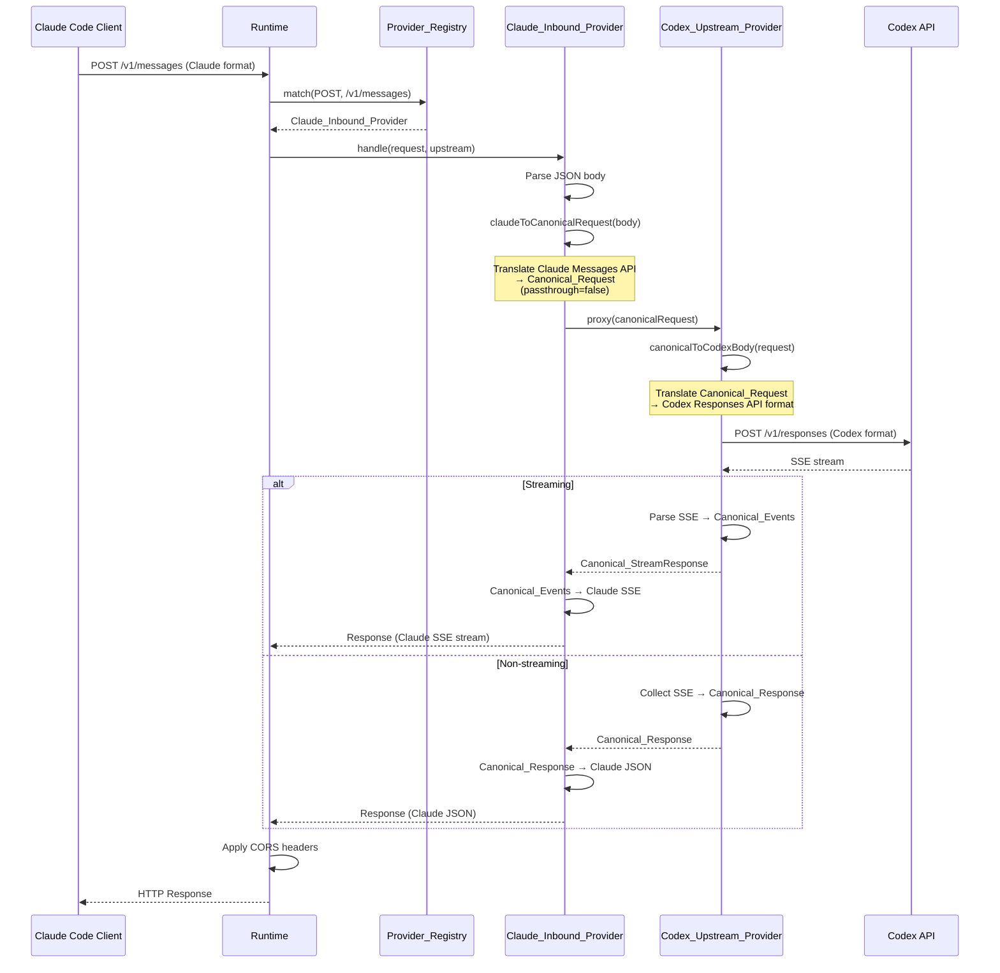
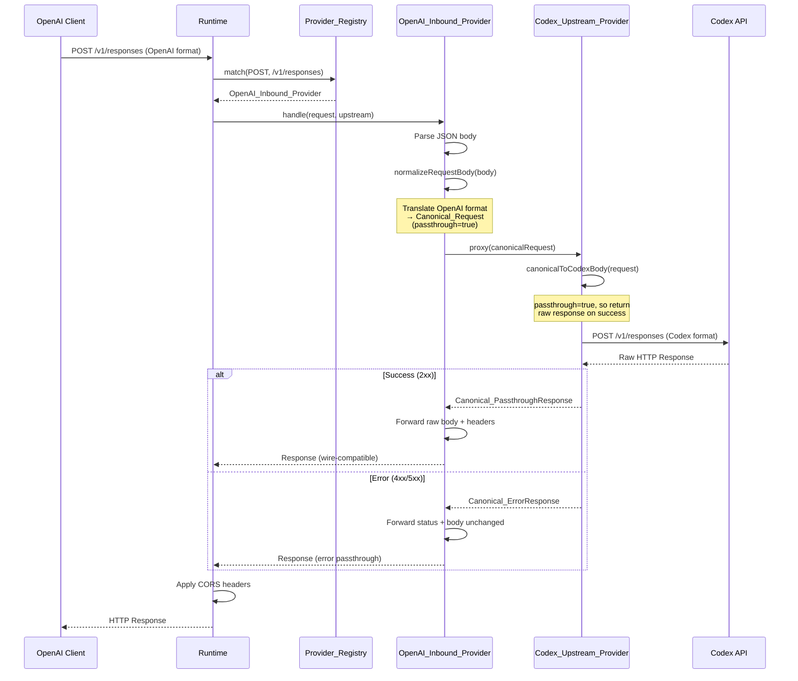
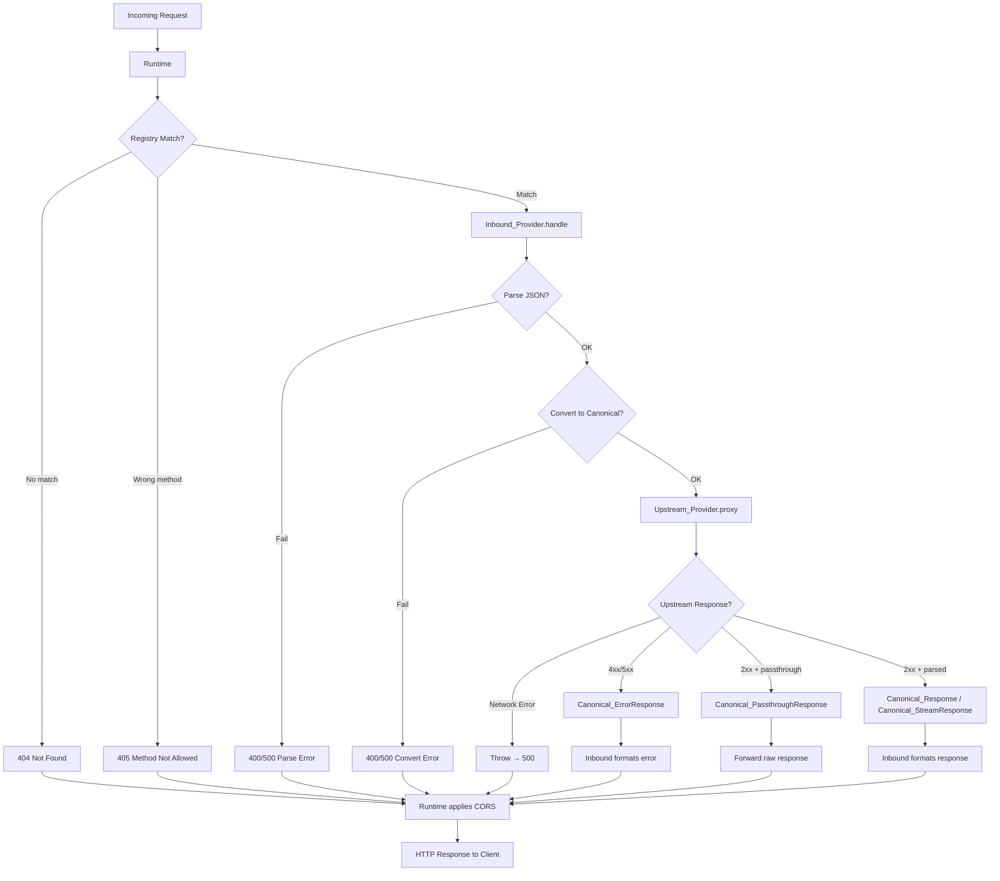

# Design Document: Provider-Agnostic Architecture

## Overview

This design refactors the codex2claudecode proxy server from a monolithic, Claude-centric architecture into a provider-agnostic system with clean separation between inbound API format adapters, upstream LLM connectors, and shared core utilities. The refactoring introduces a canonical internal request/response representation that decouples inbound providers (Claude, OpenAI-compatible) from upstream providers (Codex), enabling independent development and testing of each layer.

### Design Goals

- **Decoupling**: Inbound providers translate to/from canonical types without knowledge of upstream wire formats. Upstream providers translate from canonical types without knowledge of inbound API formats.
- **Extensibility**: Adding a new inbound or upstream provider requires only creating files in the appropriate directory and registering at startup.
- **Backward Compatibility**: All existing `src/**` import paths remain functional via re-exports. All existing tests pass without modification.
- **Zero Runtime Regression**: Same endpoints, same request/response formats, same port fallback, health monitoring, and logging behavior.

### Key Design Decisions

1. **Canonical types as the integration contract**: Rather than having inbound providers call upstream APIs directly, all communication flows through typed canonical representations. This is the fundamental architectural change.
2. **Passthrough hint for wire-compatible forwarding**: OpenAI-compatible routes need raw upstream responses without structural transformation. The `passthrough` flag on `Canonical_Request` signals the upstream provider to return a `Canonical_PassthroughResponse` wrapping the raw HTTP response.
3. **Provider Registry with specificity-ordered routing**: Route descriptors support path + method + optional header discriminators, evaluated in specificity order (exact > presence > none) with registration-order tie-breaking.
4. **Re-export shims for backward compatibility**: Original file paths become thin re-export modules pointing to the new canonical locations, preserving the published `src/**` surface.
5. **Composition root separates wiring from serving**: `bootstrap.ts` is the only module that imports concrete provider implementations (Claude_Inbound_Provider, OpenAI_Inbound_Provider, Codex_Upstream_Provider). It creates instances, registers them with the Provider_Registry, and passes the registry + upstream to `runtime.ts`. The runtime itself only depends on the abstract interfaces from `core/interfaces.ts`, never on concrete providers. The public `startRuntime(options?: RuntimeOptions)` signature remains unchanged for backward compatibility — `bootstrap.ts` is called internally by `startRuntime` to perform provider wiring before starting the server. External consumers continue to call `startRuntime(options?)` exactly as before.

## Architecture

### Directory Structure

```
src/
├── core/                          # Provider-agnostic shared modules
│   ├── types.ts                   # Canonical types + shared types (JsonObject, RequestOptions, etc.)
│   ├── canonical.ts               # Canonical_Request, Canonical_Response, Canonical_StreamResponse,
│   │                              #   Canonical_ErrorResponse, Canonical_PassthroughResponse, Canonical_Event
│   ├── interfaces.ts              # Upstream_Provider, Inbound_Provider, Route_Descriptor, Credential_Store
│   ├── registry.ts                # Provider_Registry implementation
│   ├── sse.ts                     # SSE parsing (consumeCodexSse, parseSseJson, parseJsonObject, StreamIdleTimeoutError)
│   ├── http.ts                    # HTTP utilities (responseHeaders, cors)
│   ├── paths.ts                   # File path utilities (appDataDir, defaultAuthFile, resolveAuthFile, etc.)
│   ├── request-logs.ts            # Request logging utilities
│   ├── reasoning.ts               # normalizeReasoningBody (model suffix → reasoning object)
│   └── constants.ts               # Generic constants (LOG_BODY_PREVIEW_LIMIT, STREAM_IDLE_TIMEOUT_MS)
│
├── inbound/                       # Inbound API format adapters
│   ├── claude/                    # Claude Messages API adapter
│   │   ├── index.ts               # Claude_Inbound_Provider implementation
│   │   ├── convert.ts             # Claude → Canonical_Request translation
│   │   ├── response.ts            # Canonical_Response/Canonical_StreamResponse → Claude format
│   │   ├── errors.ts              # Claude error formatting
│   │   ├── handlers.ts            # Request handler orchestration
│   │   ├── server-tools.ts        # Server tool resolution (web, MCP)
│   │   ├── server-tool-adapter.ts # Server tool adapter interface
│   │   ├── web.ts                 # Web search/fetch tool mapping
│   │   ├── mcp.ts                 # MCP toolset mapping
│   │   ├── sse.ts                 # Re-export from core/sse (backward compat)
│   │   └── models.ts              # Claude-specific model formatting + settings.json reader
│   │
│   └── openai/                    # OpenAI-compatible passthrough adapter
│       ├── index.ts               # OpenAI_Inbound_Provider implementation
│       └── normalize.ts           # normalizeRequestBody (chat completions → canonical input)
│
├── upstream/                      # Upstream LLM connectors
│   └── codex/                     # Codex/OpenAI upstream provider
│       ├── index.ts               # Codex_Upstream_Provider implementation
│       ├── client.ts              # HTTP client, auth refresh, header sanitization
│       ├── auth.ts                # OAuth types, JWT parsing, auth file I/O
│       ├── codex-auth.ts          # Codex CLI auth syncing
│       ├── constants.ts           # Codex-specific constants (endpoints, client ID, issuer)
│       ├── account-info.ts        # Account info file management
│       ├── connect-account.ts     # Account connection flow
│       └── parse.ts               # Codex SSE → Canonical_Response/Canonical_StreamResponse parsing
│
├── runtime.ts                     # Runtime server (uses registry + upstream interface, no provider imports)
├── bootstrap.ts                   # Composition root: imports concrete providers, creates instances,
│                                  #   registers with registry, and passes to runtime.startRuntime()
│
├── # ── Backward-compatible re-export shims ──
├── types.ts                       # Re-exports from core/types
├── auth.ts                        # Re-exports from upstream/codex/auth
├── client.ts                      # Re-exports CodexStandaloneClient from upstream/codex/client
├── http.ts                        # Re-exports from core/http
├── paths.ts                       # Re-exports from core/paths
├── constants.ts                   # Re-exports from core/constants + upstream/codex/constants
├── request-logs.ts                # Re-exports from core/request-logs
├── reasoning.ts                   # Re-exports normalizeReasoningBody from core/reasoning
│                                  #   + normalizeRequestBody from inbound/openai/normalize
├── models.ts                      # Re-exports from inbound/claude/models
├── account-info.ts                # Re-exports from upstream/codex/account-info
├── codex-auth.ts                  # Re-exports from upstream/codex/codex-auth
├── connect-account.ts             # Re-exports from upstream/codex/connect-account
├── claude-code-env.config.ts      # Re-exports (unchanged, imports from inbound/claude/models)
├── claude.ts                      # Re-exports handleClaudeMessages, handleClaudeCountTokens
├── claude/                        # Re-export shims for all src/claude/* paths
│   ├── index.ts
│   ├── convert.ts
│   ├── errors.ts
│   ├── handlers.ts
│   ├── response.ts
│   ├── sse.ts
│   ├── web.ts
│   ├── server-tools.ts
│   ├── server-tool-adapter.ts
│   └── mcp.ts
├── index.ts                       # Public API barrel (unchanged exports)
├── bin.ts                         # CLI entry point (unchanged)
├── cli.ts                         # CLI option parsing (unchanged)
├── package-info.ts                # Package info (unchanged)
└── ui/                            # UI modules (unchanged, paths preserved)
```

### Module Dependency Diagram

```mermaid
graph TD
    subgraph Core["core/"]
        CT[types.ts]
        CC[canonical.ts]
        CI[interfaces.ts]
        CR[registry.ts]
        CSSE[sse.ts]
        CH[http.ts]
        CP[paths.ts]
        CRL[request-logs.ts]
        CRE[reasoning.ts]
        CCO[constants.ts]
    end

    subgraph Inbound["inbound/"]
        subgraph Claude["claude/"]
            CIP[Claude_Inbound_Provider]
            CONV[convert.ts]
            RESP[response.ts]
            ERR[errors.ts]
            HAND[handlers.ts]
            ST[server-tools.ts]
            WEB[web.ts]
            MCP[mcp.ts]
            CMOD[models.ts]
        end
        subgraph OpenAI["openai/"]
            OIP[OpenAI_Inbound_Provider]
            NORM[normalize.ts]
        end
    end

    subgraph Upstream["upstream/"]
        subgraph Codex["codex/"]
            CUP[Codex_Upstream_Provider]
            CLI[client.ts]
            AUTH[auth.ts]
            CAUTH[codex-auth.ts]
            CCON[constants.ts]
            ACCT[account-info.ts]
            PARSE[parse.ts]
        end
    end

    RT[runtime.ts]
    BT[bootstrap.ts]

    CI --> CT
    CI --> CC
    CR --> CI
    CRL --> CP

    CIP --> CI
    CIP --> CC
    CIP --> CT
    CONV --> CC
    CONV --> CT
    RESP --> CC
    HAND --> CI
    ST --> CT
    WEB --> CT
    MCP --> CT
    CMOD --> CT

    OIP --> CI
    OIP --> CC
    NORM --> CC
    NORM --> CRE

    CUP --> CI
    CUP --> CC
    CUP --> CT
    CLI --> AUTH
    CLI --> CCON
    CLI --> CRE
    PARSE --> CC
    PARSE --> CSSE

    RT --> CI
    RT --> CR
    RT --> CH
    RT --> CRL
    RT --> CCO
    RT --> CP

    BT --> RT
    BT -.->|creates & registers| CIP
    BT -.->|creates & registers| OIP
    BT -.->|creates| CUP
```



### Data Flow: Claude Request Path



### Data Flow: OpenAI-Compatible Request Path



## Components and Interfaces

### Upstream_Provider Interface

```typescript
// core/interfaces.ts

import type { HealthStatus, RequestOptions } from "./types"
import type {
  Canonical_Request,
  Canonical_Response,
  Canonical_StreamResponse,
  Canonical_ErrorResponse,
  Canonical_PassthroughResponse,
} from "./canonical"

export type UpstreamResult =
  | Canonical_Response
  | Canonical_StreamResponse
  | Canonical_ErrorResponse
  | Canonical_PassthroughResponse

export interface Upstream_Provider {
  /** Send a canonical request to the upstream LLM and return a canonical response. */
  proxy(request: Canonical_Request, options?: RequestOptions): Promise<UpstreamResult>

  /** Check upstream health. */
  checkHealth(timeoutMs: number): Promise<HealthStatus>

  /** Optional: query usage information. */
  usage?(options?: RequestOptions): Promise<Response>

  /** Optional: query environment information. */
  environments?(options?: RequestOptions): Promise<Response>
}

/**
 * Optional capability interface for upstream providers that manage
 * token-based credentials. Uses generic types so Core has no
 * knowledge of any specific upstream provider's token shape.
 */
export interface TokenCredentialProvider<T = unknown> {
  refresh(): Promise<T>
  readonly tokens: T
}
```

### Inbound_Provider Interface

```typescript
// core/interfaces.ts (continued)

export interface Route_Descriptor {
  /** URL path pattern (e.g., "/v1/messages", "/v1/models/:model_id") */
  path: string
  /** HTTP method */
  method: "GET" | "POST" | "PUT" | "DELETE" | "PATCH"
  /** Optional base path prefix for provider-level namespacing (e.g., "/claude", "/openai").
   *  When set, the full matched path is basePath + path. Defaults to "" (no prefix). */
  basePath?: string
  /** Optional header-based discriminator */
  headerDiscriminator?: {
    name: string
    mode: "presence" | "exact"
    value?: string  // Required when mode is "exact"
  }
}

export interface Inbound_Provider {
  /** Provider name for logging and diagnostics */
  readonly name: string

  /** Return the set of route descriptors this provider handles */
  routes(): Route_Descriptor[]

  /**
   * Handle an incoming HTTP request.
   * Returns an HTTP Response. The Runtime applies CORS after this returns.
   */
  handle(
    request: Request,
    route: Route_Descriptor,
    upstream: Upstream_Provider,
    context: RequestHandlerContext,
  ): Promise<Response>
}

export interface RequestHandlerContext {
  requestId: string
  logBody: boolean
  quiet: boolean
  onProxy?: (entry: RequestProxyLog) => void
}
```

### Credential_Store Interface

```typescript
// core/interfaces.ts (continued)

export interface Credential_Store {
  /** Read credentials from storage */
  read(): Promise<unknown>
  /** Persist credentials to storage */
  write(credentials: unknown): Promise<void>
}
```

### Provider_Registry

```typescript
// core/registry.ts

export interface RegisteredRoute {
  descriptor: Route_Descriptor
  provider: Inbound_Provider
}

export class Provider_Registry {
  private routes: RegisteredRoute[] = []

  /**
   * Register an inbound provider with its route descriptors.
   * Throws if any descriptor conflicts with an already-registered one.
   */
  register(provider: Inbound_Provider): void

  /**
   * Match an incoming request against registered routes.
   * Returns the matched route and provider, or undefined if no match.
   * Path matching resolves basePath + path pattern against the request pathname.
   * Evaluation order: exact header > presence header > no header discriminator.
   * Tie-breaker within same specificity: registration order (first wins).
   */
  match(method: string, pathname: string, headers: Headers): RegisteredRoute | undefined

  /**
   * List all registered routes with their owning providers.
   * Used for the root endpoint info response.
   */
  listRoutes(): Array<{ path: string; method: string; provider: string }>
}
```

### Canonical Types

```typescript
// core/canonical.ts

import type { JsonObject } from "./types"

// ── Request ──

export interface Canonical_Request {
  model: string
  instructions?: string
  input: Canonical_InputMessage[]
  tools?: JsonObject[]
  toolChoice?: JsonObject | string
  include?: string[]
  textFormat?: JsonObject
  reasoningEffort?: string
  stream: boolean
  passthrough: boolean
  metadata: Record<string, unknown>
}

export interface Canonical_InputMessage {
  role: "user" | "assistant" | "tool"
  content: JsonObject[]
}

// ── Response (non-streaming success) ──

export interface Canonical_Response {
  type: "canonical_response"
  id: string
  model: string
  stopReason: string
  content: Canonical_ContentBlock[]
  usage: Canonical_Usage
}

export type Canonical_ContentBlock =
  | Canonical_TextBlock
  | Canonical_ToolCallBlock
  | Canonical_ServerToolBlock
  | Canonical_ThinkingBlock

export interface Canonical_TextBlock {
  type: "text"
  text: string
  annotations?: JsonObject[]
}

export interface Canonical_ToolCallBlock {
  type: "tool_call"
  id: string
  callId: string
  name: string
  arguments: string
}

export interface Canonical_ServerToolBlock {
  type: "server_tool"
  blocks: JsonObject[]
}

export interface Canonical_ThinkingBlock {
  type: "thinking"
  thinking: string
  signature: string
}

export interface Canonical_Usage {
  inputTokens: number
  outputTokens: number
  serverToolUse?: {
    webSearchRequests?: number
    webFetchRequests?: number
    mcpCalls?: number
  }
}

// ── Stream Response ──

export interface Canonical_StreamResponse {
  type: "canonical_stream"
  status: number
  id: string
  model: string
  events: AsyncIterable<Canonical_Event>
}

export type Canonical_Event =
  | { type: "text_delta"; delta: string }
  | { type: "text_done"; text: string }
  | { type: "tool_call_delta"; callId: string; name: string; argumentsDelta: string }
  | { type: "tool_call_done"; callId: string; name: string; arguments: string }
  | { type: "server_tool_block"; blocks: JsonObject[] }
  | { type: "thinking_delta"; label?: string; text?: string }
  | { type: "thinking_signature"; signature: string }
  | { type: "usage"; usage: Partial<Canonical_Usage> }
  | { type: "content_block_start"; blockType: string; index: number; block?: JsonObject }
  | { type: "content_block_stop"; index: number }
  | { type: "message_start"; id: string; model: string }
  | { type: "message_stop"; stopReason: string }
  | { type: "error"; message: string }
  | { type: "completion"; output?: unknown; usage?: Canonical_Usage; stopReason?: string; incompleteReason?: string }
  | { type: "lifecycle"; label: string }
  | { type: "message_item_done"; item: JsonObject }

// ── Error Response ──

export interface Canonical_ErrorResponse {
  type: "canonical_error"
  status: number
  headers: Headers
  body: string
}

// ── Passthrough Response ──

export interface Canonical_PassthroughResponse {
  type: "canonical_passthrough"
  status: number
  statusText: string
  headers: Headers
  body: ReadableStream<Uint8Array> | string | null
}
```

### Codex_Upstream_Provider

```typescript
// upstream/codex/index.ts

export class Codex_Upstream_Provider implements Upstream_Provider, TokenCredentialProvider<CodexClientTokens> {
  private accessToken: string       // Internal state (same fields as current CodexStandaloneClient)
  private refreshToken: string
  private expiresAt?: number
  private accountId?: string
  // ... (all private fields from current CodexStandaloneClient)

  /** Options type for Codex upstream construction (mirrors current CodexClientOptions) */
  constructor(options: CodexClientOptions)

  static async fromAuthFile(path?: string, options?: Omit<CodexClientOptions, "accessToken" | "refreshToken" | "expiresAt" | "accountId" | "authFile">): Promise<Codex_Upstream_Provider>

  async proxy(request: Canonical_Request, options?: RequestOptions): Promise<UpstreamResult> {
    // 1. Translate Canonical_Request → Codex Responses API body
    // 2. Send to Codex endpoint
    // 3. If request.passthrough && response.ok → return Canonical_PassthroughResponse
    // 4. If !response.ok → return Canonical_ErrorResponse
    // 5. If streaming → parse SSE into Canonical_Events, return Canonical_StreamResponse
    // 6. If non-streaming → collect SSE, return Canonical_Response
  }

  async checkHealth(timeoutMs: number): Promise<HealthStatus> { /* ... */ }
  async usage(options?: RequestOptions): Promise<Response> { /* ... */ }
  async environments(options?: RequestOptions): Promise<Response> { /* ... */ }
  async refresh(): Promise<CodexClientTokens> { /* ... */ }
  get tokens(): CodexClientTokens { /* ... */ }
}
```

### Claude_Inbound_Provider

```typescript
// inbound/claude/index.ts

export class Claude_Inbound_Provider implements Inbound_Provider {
  readonly name = "claude"

  constructor(private modelResolver?: () => Promise<string[]>)

  routes(): Route_Descriptor[] {
    return [
      { path: "/v1/messages", method: "POST" },
      { path: "/v1/message", method: "POST" },           // backward-compat alias
      { path: "/v1/messages/count_tokens", method: "POST" },
      { path: "/v1/models", method: "GET" },
      { path: "/v1/models/:model_id", method: "GET" },
    ]
  }

  async handle(request: Request, route: Route_Descriptor, upstream: Upstream_Provider, context: RequestHandlerContext): Promise<Response> {
    // Dispatch based on route.path to appropriate handler
    // - /v1/messages, /v1/message → handleClaudeMessages
    // - /v1/messages/count_tokens → handleClaudeCountTokens
    // - /v1/models → handleListModels
    // - /v1/models/:model_id → handleGetModel
  }
}
```

### OpenAI_Inbound_Provider

```typescript
// inbound/openai/index.ts

export class OpenAI_Inbound_Provider implements Inbound_Provider {
  readonly name = "openai"

  routes(): Route_Descriptor[] {
    return [
      { path: "/v1/responses", method: "POST" },
      { path: "/v1/chat/completions", method: "POST" },
    ]
  }

  async handle(request: Request, route: Route_Descriptor, upstream: Upstream_Provider, context: RequestHandlerContext): Promise<Response> {
    // 1. Parse JSON body (return 500 on invalid JSON)
    // 2. normalizeRequestBody(route.path, body) → Canonical_Request with passthrough=true
    // 3. upstream.proxy(canonicalRequest)
    // 4. If Canonical_PassthroughResponse → forward raw body + headers
    // 5. If Canonical_ErrorResponse → forward status + body
  }
}
```

### Model_Catalog

```typescript
// inbound/claude/models.ts

export interface ModelResolverFn {
  (): Promise<string[]>
}

export class Model_Catalog {
  private catalog: ModelInfo[]
  private aliases: Record<string, string>
  private modelMap: Map<string, ModelInfo>

  constructor(modelsJson: typeof import("../../models.json"))

  /** Get a model by ID, resolving aliases */
  getModel(modelId: string): ModelInfo | undefined

  /** List active models using the injected resolver.
   *  Pagination matches current Claude API: afterId, beforeId, limit (default 20, max 1000). */
  async listModels(resolver?: ModelResolverFn, pagination?: { afterId?: string; beforeId?: string; limit?: number }): Promise<ListModelsResponse>

  /** Resolve an alias to a canonical model ID */
  resolveAlias(raw: string): string
}

/**
 * Claude-specific model resolver that reads ~/.claude/settings.json.
 * Injected into Model_Catalog by Claude_Inbound_Provider.
 */
export function claudeSettingsModelResolver(): Promise<string[]>
```

### Runtime Infrastructure Routes

The Runtime handles the following routes directly (not via Provider_Registry):

```typescript
// runtime.ts — infrastructure routes handled directly by Runtime

// Root info
GET /                          → JSON with server status, config, registered endpoints

// Health
GET /health                    → { ok, runtime, codex: healthStatus }
HEAD /health                   → same

// Test connection
GET /test-connection           → upstream.checkHealth() result

// Usage (delegated to upstream optional methods)
GET /usage                     → upstream.usage() or 501
GET /wham/usage                → upstream.usage() or 501  (legacy alias)

// Environments (delegated to upstream optional methods)
GET /environments              → upstream.environments() or 501
GET /wham/environments         → upstream.environments() or 501  (legacy alias)

// CORS preflight
OPTIONS *                      → 204 with CORS headers
```

When `upstream.usage` or `upstream.environments` is not implemented (method is `undefined`), the Runtime returns HTTP 501 `{ error: { message: "Not implemented" } }`.

## Data Models

### Canonical_Request Field Mapping

| Canonical_Request Field | Claude Messages API Source | OpenAI Responses API Source | OpenAI Chat Completions Source |
|---|---|---|---|
| `model` | `body.model` | `body.model` | `body.model` |
| `instructions` | `body.system` (filtered) | `body.instructions` or default | `messages[role=system\|developer]` |
| `input` | `body.messages` (translated) | `body.input` (normalized) | `messages[role=user\|assistant\|tool]` |
| `tools` | `body.tools` (resolved) | `body.tools` | `body.tools` |
| `toolChoice` | `body.tool_choice` (mapped) | `body.tool_choice` | `body.tool_choice` |
| `include` | Derived from tool resolution | `body.include` | — |
| `textFormat` | `body.output_config.format` | `body.text` | — |
| `reasoningEffort` | `body.output_config.effort` | `body.reasoning_effort` or suffix | suffix parsing |
| `stream` | `body.stream` | `body.stream ?? true` | `true` (forced by normalizeRequestBody) |
| `passthrough` | `false` | `true` | `true` |
| `metadata` | Extensible map | Extensible map | Extensible map |

### Canonical_Response → Claude Messages API Mapping

| Canonical_Response Field | Claude Messages API Output |
|---|---|
| `id` | `id` (prefixed `msg_`) |
| `model` | `model` |
| `stopReason` | `stop_reason` (mapped: `"end_turn"`, `"max_tokens"`, `"tool_use"`) |
| `content[type=text]` | `content[type=text]` with citations |
| `content[type=tool_call]` | `content[type=tool_use]` |
| `content[type=server_tool]` | `content[type=server_tool_use\|web_search_tool_result\|mcp_tool_use\|mcp_tool_result]` |
| `content[type=thinking]` | `content[type=thinking]` |
| `usage.inputTokens` | `usage.input_tokens` |
| `usage.outputTokens` | `usage.output_tokens` |
| `usage.serverToolUse` | `usage.server_tool_use` |

### Route_Descriptor Conflict Resolution

```
Registration order:
  1. Claude: POST /v1/messages
  2. Claude: POST /v1/message
  3. Claude: POST /v1/messages/count_tokens
  4. Claude: GET /v1/models
  5. Claude: GET /v1/models/:model_id
  6. OpenAI: POST /v1/responses
  7. OpenAI: POST /v1/chat/completions

No conflicts: all paths are unique per method.
```


## Correctness Properties

*A property is a characteristic or behavior that should hold true across all valid executions of a system — essentially, a formal statement about what the system should do. Properties serve as the bridge between human-readable specifications and machine-verifiable correctness guarantees.*

### Property 1: Canonical_Request round-trip structural equivalence

*For any* valid Canonical_Request object, translating it to Codex Responses API format and then parsing the resulting structure back into a Canonical_Request SHALL preserve the model identifier, instruction text, message count, and tool count.

**Validates: Requirements 1.10**

### Property 2: Inbound translation produces valid Canonical_Request

*For any* valid inbound API request body (Claude Messages API or OpenAI-compatible format), translating it through the corresponding Inbound_Provider SHALL produce a Canonical_Request where: the model field matches the input model, the input array has the same number of user/assistant messages as the source, the passthrough flag is `false` for Claude and `true` for OpenAI-compatible, and all tool definitions are preserved.

**Validates: Requirements 1.8, 6.3, 7.3**

### Property 3: Upstream translation produces structurally correct Codex body

*For any* valid Canonical_Request, translating it to Codex Responses API format SHALL produce a JSON object containing: the model field (with reasoning suffix stripped), an `input` array with the same number of message items, `store: false`, a `stream` field matching the canonical request's stream value, and tool definitions matching the canonical tools count.

**Validates: Requirements 1.9, 3.8**

### Property 4: Canonical_Response to Claude format preserves content

*For any* valid Canonical_Response, translating it to Claude Messages API format SHALL produce a response where: the `id` starts with `msg_`, the `model` matches, the number of content blocks is preserved (text blocks map to text, tool_call blocks map to tool_use, server_tool blocks map to server tool types), and usage statistics (input_tokens, output_tokens) match the canonical values.

**Validates: Requirements 6.4**

### Property 5: Codex SSE event sequence produces valid Canonical_Response

*For any* valid sequence of Codex SSE events (containing at minimum a `response.completed` event with usage), parsing the sequence into a Canonical_Response SHALL produce a response where: the usage input/output tokens match the completed event's values, text content from `response.output_text.done` events is captured, and function calls from `response.output_item.done` events are captured with correct call IDs and names.

**Validates: Requirements 3.9**

### Property 6: Provider_Registry matches the correct provider for any registered route

*For any* set of non-conflicting Route_Descriptors registered with the Provider_Registry, and *for any* HTTP request whose path and method match exactly one registered descriptor, the registry SHALL return the provider that registered that descriptor. Routes with different HTTP methods on the same path SHALL be independently matchable.

**Validates: Requirements 4.3, 5.2, 9.2**

### Property 7: Provider_Registry detects all conflicting route registrations

*For any* two Route_Descriptors with the same resolved path pattern, same HTTP method, and equivalent header discriminators (both none, or both checking the same header with the same mode and value), attempting to register both SHALL result in a conflict error. Conversely, two descriptors that differ in path, method, or have non-equivalent discriminators SHALL NOT conflict.

**Validates: Requirements 5.4, 9.3**

### Property 8: Provider_Registry specificity ordering

*For any* set of registered Route_Descriptors where multiple descriptors match a given request at different specificity levels (exact header match, presence header match, no header discriminator), the registry SHALL return the descriptor with the highest specificity. Within the same specificity level, registration order SHALL be the tie-breaker (first registered wins).

**Validates: Requirements 5.5**

### Property 9: All src/** module paths remain importable

*For any* module path currently importable under the `src/**` directory tree (as published via the `files` field in package.json), that path SHALL remain importable after refactoring — either at its original location or via a re-export shim. All symbols currently exported from each module SHALL be present in the re-exported module.

**Validates: Requirements 12.2, 12.4, 12.5, 12.6, 13.5**

## Error Handling

### Inbound Provider Errors

| Error Condition | Claude Inbound | OpenAI Inbound |
|---|---|---|
| Invalid JSON body | 400 with Claude error format (`type: "error"`, `error.type: "invalid_request_error"`) | 500 with `{ error: { message } }` |
| Request conversion failure | 400 with Claude error format | 500 with `{ error: { message } }` |
| Upstream returns Canonical_ErrorResponse | Forward status + body in Claude error format | Forward status + body unchanged |
| Upstream proxy() throws | 500 with Claude error format | 500 with `{ error: { message } }` |
| Stream idle timeout | Claude stream error event + close | N/A (passthrough) |
| Stream upstream failure | Claude stream error event + close | N/A (passthrough) |

### Upstream Provider Errors

| Error Condition | Codex Upstream Behavior |
|---|---|
| Network error | Throw Error (caught by inbound provider) |
| 401 from upstream | Refresh tokens, retry once. If retry fails, return Canonical_ErrorResponse |
| 4xx/5xx from upstream | Return Canonical_ErrorResponse with status, headers, body |
| Token refresh failure | Throw Error |
| SSE parse error | Throw Error (caught by stream consumer) |
| Stream idle timeout | Throw StreamIdleTimeoutError |

### Runtime Infrastructure Errors

| Error Condition | Runtime Behavior |
|---|---|
| No matching route | 404 `{ error: { message: "Not found" } }` |
| Wrong HTTP method on known route | 405 `{ error: { message: "Method not allowed" } }` |
| Upstream doesn't implement usage/environments | 501 `{ error: { message: "Not implemented" } }` |
| Request log write failure | Log warning, continue serving (non-fatal) |
| Port in use | Increment port, retry up to 65535 |
| Health check failure | Report unhealthy status, continue serving |

### Error Propagation Flow



## Testing Strategy

### Dual Testing Approach

This feature uses both unit tests and property-based tests for comprehensive coverage:

- **Property-based tests** verify universal properties across randomly generated inputs (canonical type translations, registry routing, backward compatibility)
- **Unit tests** verify specific examples, edge cases, error conditions, and integration points

### Property-Based Testing

**Library**: [fast-check](https://github.com/dubzzz/fast-check) (TypeScript PBT library, well-maintained, works with bun:test)

**Configuration**: Minimum 100 iterations per property test.

**Tag format**: `Feature: provider-agnostic-architecture, Property {number}: {property_text}`

Each correctness property from the design document maps to a single property-based test:

| Property | Test Description | Generator Strategy |
|---|---|---|
| 1 | Canonical_Request round-trip | Generate random Canonical_Request with varying models, messages, tools |
| 2 | Inbound translation validity | Generate random Claude/OpenAI request bodies with varying message structures |
| 3 | Upstream translation correctness | Generate random Canonical_Request objects |
| 4 | Claude response format preservation | Generate random Canonical_Response with varying content block types |
| 5 | Codex SSE parsing | Generate random valid SSE event sequences |
| 6 | Registry matching | Generate random non-conflicting route sets + matching requests |
| 7 | Registry conflict detection | Generate random pairs of route descriptors |
| 8 | Registry specificity ordering | Generate route sets with overlapping paths at different specificity levels |
| 9 | Module path importability | Enumerate all current src/** paths (static, not generated) |

### Unit Testing

Unit tests focus on:

- **Specific examples**: Known Claude request → Canonical_Request → Codex body translations with concrete values
- **Edge cases**: Empty messages, missing fields, invalid JSON, whitespace-only content, unknown tool types
- **Error conditions**: 401 retry, network failures, stream timeouts, malformed SSE
- **Integration points**: Runtime startup, provider registration, health monitoring, request logging
- **Backward compatibility**: Specific import path verification for all re-export shims

### Test Organization

```
test/
├── core/
│   ├── registry.test.ts          # Provider_Registry unit + property tests
│   ├── canonical.test.ts         # Canonical type construction tests
│   └── sse.test.ts               # SSE parsing (moved from existing)
├── inbound/
│   ├── claude.test.ts            # Claude inbound translation tests (existing + new)
│   └── openai.test.ts            # OpenAI inbound translation tests
├── upstream/
│   └── codex.test.ts             # Codex upstream tests (existing + new)
├── runtime.test.ts               # Runtime integration tests (existing)
├── backward-compat.test.ts       # Re-export verification tests
└── helpers.ts                    # Shared test utilities
```

### Migration Strategy

The refactoring follows a phased approach to minimize risk:

1. **Phase 1 — Core types and interfaces**: Create `core/` directory with canonical types, interfaces, registry. No existing code changes.
2. **Phase 2 — Provider Registry**: Implement and test the registry independently.
3. **Phase 3 — Codex Upstream Provider**: Extract `CodexStandaloneClient` logic into `upstream/codex/`, implementing the `Upstream_Provider` interface. Add Codex SSE → canonical parsing.
4. **Phase 4 — Claude Inbound Provider**: Extract Claude handlers into `inbound/claude/`, translating to/from canonical types instead of directly to Codex format.
5. **Phase 5 — OpenAI Inbound Provider**: Extract OpenAI-compatible routes into `inbound/openai/`.
6. **Phase 6 — Runtime refactoring**: Update `runtime.ts` to use registry + upstream interface, removing all provider-specific imports.
7. **Phase 7 — Re-export shims**: Create backward-compatible re-exports at all original paths.
8. **Phase 8 — Verification**: Run full test suite, verify all existing tests pass without modification.

### Re-Export Strategy

Every original `src/**` module path gets a thin re-export shim:

```typescript
// src/types.ts (re-export shim)
export * from "./core/types"

// src/auth.ts (re-export shim)
export * from "./upstream/codex/auth"

// src/client.ts (re-export shim)
export { CodexStandaloneClient } from "./upstream/codex/client"
export type { CodexClientOptions, CodexClientTokens } from "./upstream/codex/client"

// src/reasoning.ts (re-export shim)
export { normalizeReasoningBody } from "./core/reasoning"
export { normalizeRequestBody } from "./inbound/openai/normalize"
```

The `src/claude/` directory retains shim files that re-export from `src/inbound/claude/`:

```typescript
// src/claude/convert.ts (re-export shim)
export * from "../inbound/claude/convert"

// src/claude/handlers.ts (re-export shim)
export * from "../inbound/claude/handlers"
```

This ensures that any consumer importing from `codex2claudecode/src/claude/convert` continues to work.
