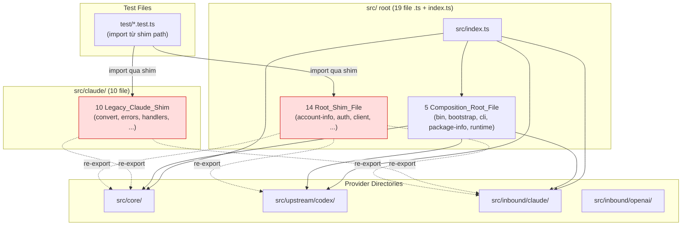
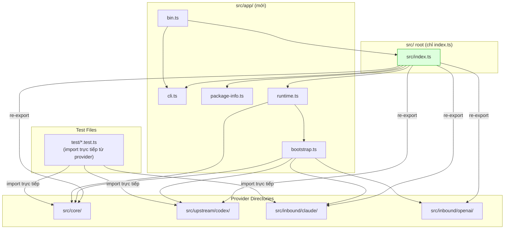

# Design Document: Remove Root Shims

## Overview

Feature này hoàn tất quá trình dọn dẹp cấu trúc `src/` bằng cách xóa tất cả file `.ts` nằm trực tiếp trong `src/` (ngoại trừ `src/index.ts`) và xóa thư mục `src/claude/`. Spec trước (`consolidate-root-shims`) đã cập nhật tất cả internal consumer để import trực tiếp từ Provider_Directory — các shim file giờ là dead code.

**Phạm vi thay đổi:**

- **Xóa 14 Root_Shim_File** — chỉ chứa re-export, không có logic
- **Xóa thư mục `src/claude/`** — 10 legacy shim file
- **Di chuyển 5 Composition_Root_File** vào `src/app/`: `bin.ts`, `bootstrap.ts`, `cli.ts`, `package-info.ts`, `runtime.ts`
- **Cập nhật ~15 test file** import từ các file bị xóa/di chuyển
- **Cập nhật Backward_Compat_Baseline** và property-based test
- **Cập nhật Root_Entry** (`index.ts` tại root project) và `src/index.ts`

**Kết quả cuối cùng:** Thư mục `src/` chỉ chứa `index.ts` và 5 subdirectory: `app/`, `core/`, `inbound/`, `upstream/`, `ui/`.

## Architecture

### Kiến trúc hiện tại — Shim file vẫn tồn tại (dead code)



### Kiến trúc sau khi xóa shim — Clean structure



### Quyết định thiết kế

1. **Tạo `src/app/` cho Composition_Root_File:** Các file `bin.ts`, `bootstrap.ts`, `cli.ts`, `package-info.ts`, `runtime.ts` chứa logic cross-cutting (CLI parsing, server bootstrap, runtime loop). Chúng không thuộc một provider directory cụ thể nào, nên đặt trong `src/app/` — thư mục dành cho application-level concerns. Lý do chọn `app/` thay vì giữ tại root: đảm bảo `src/` chỉ chứa `index.ts` và subdirectory, tạo cấu trúc nhất quán.

2. **Xóa shim thay vì giữ:** Spec trước giữ shim cho backward compatibility. Spec này xóa chúng vì: (a) tất cả internal consumer đã import trực tiếp, (b) external consumer import qua package name (`codex2claudecode`) sẽ đi qua `src/index.ts` — không bị ảnh hưởng, (c) backward compat baseline sẽ được cập nhật để phản ánh cấu trúc mới.

3. **Cập nhật test file import trực tiếp:** Test file hiện import từ shim path (ví dụ: `../src/client`). Sau khi xóa shim, cập nhật để import trực tiếp từ provider directory (ví dụ: `../src/upstream/codex/client`). Điều này cũng giúp test file phản ánh đúng kiến trúc thực tế.

4. **Giữ nguyên `package.json` bin field:** `bin` trỏ đến `./bin/codex2claudecode` — đây là shell script wrapper, không phải TypeScript file. Không cần thay đổi.

5. **Thứ tự thực hiện an toàn:** Di chuyển composition root trước (vì chúng chứa logic thực), sau đó xóa shim. Mỗi bước verify build để phát hiện lỗi sớm.

## Components and Interfaces

### Nhóm 1: File bị xóa — 14 Root_Shim_File

| File | Nội dung hiện tại | Hành động |
|------|-------------------|-----------|
| `src/account-info.ts` | `export * from "./upstream/codex/account-info"` | Xóa |
| `src/auth.ts` | `export * from "./upstream/codex/auth"` | Xóa |
| `src/client.ts` | `export { CodexStandaloneClient } from "./upstream/codex/client"` | Xóa |
| `src/codex-auth.ts` | `export * from "./upstream/codex/codex-auth"` | Xóa |
| `src/connect-account.ts` | `export * from "./upstream/codex/connect-account"` | Xóa |
| `src/constants.ts` | `export * from "./core/constants"` + `export * from "./upstream/codex/constants"` | Xóa |
| `src/http.ts` | `export * from "./core/http"` | Xóa |
| `src/models.ts` | `export * from "./inbound/claude/models"` | Xóa |
| `src/paths.ts` | `export * from "./core/paths"` | Xóa |
| `src/reasoning.ts` | `export { normalizeReasoningBody } from "./core/reasoning"` + `export { normalizeRequestBody } from "./inbound/openai/normalize"` | Xóa |
| `src/request-logs.ts` | `export * from "./core/request-logs"` | Xóa |
| `src/types.ts` | `export type { ... } from "./core/types"` + 2 nguồn khác | Xóa |
| `src/claude-code-env.config.ts` | `export { CLAUDE_CODE_ENV_CONFIG } from "./inbound/claude/..."` | Xóa |
| `src/claude.ts` | `export { handleClaudeCountTokens, handleClaudeMessages } from "./inbound/claude/handlers"` | Xóa |

### Nhóm 2: File bị xóa — 10 Legacy_Claude_Shim (toàn bộ `src/claude/`)

| File | Re-export từ | Hành động |
|------|-------------|-----------|
| `src/claude/convert.ts` | `../inbound/claude/convert` | Xóa |
| `src/claude/errors.ts` | `../inbound/claude/errors` | Xóa |
| `src/claude/handlers.ts` | `../inbound/claude/handlers` | Xóa |
| `src/claude/index.ts` | `../inbound/claude/index` | Xóa |
| `src/claude/mcp.ts` | `../inbound/claude/mcp` | Xóa |
| `src/claude/response.ts` | `../inbound/claude/response` | Xóa |
| `src/claude/server-tool-adapter.ts` | `../inbound/claude/server-tool-adapter` | Xóa |
| `src/claude/server-tools.ts` | `../inbound/claude/server-tools` | Xóa |
| `src/claude/sse.ts` | `../core/sse` | Xóa |
| `src/claude/web.ts` | `../inbound/claude/web` | Xóa |

### Nhóm 3: File di chuyển — 5 Composition_Root_File

| File gốc | File đích | Thay đổi import bên trong |
|----------|----------|---------------------------|
| `src/bin.ts` | `src/app/bin.ts` | `./cli` → `./cli` (giữ nguyên), `./index` → `../index`, `./ui` → `../ui` |
| `src/bootstrap.ts` | `src/app/bootstrap.ts` | `./core/*` → `../core/*`, `./inbound/*` → `../inbound/*`, `./upstream/*` → `../upstream/*` |
| `src/cli.ts` | `src/app/cli.ts` | Không có import tương đối — không cần thay đổi |
| `src/package-info.ts` | `src/app/package-info.ts` | Path đọc `package.json`: `".."` → `"../.."` (vì từ `src/app/` cần lên 2 cấp) |
| `src/runtime.ts` | `src/app/runtime.ts` | `./bootstrap` → `./bootstrap` (giữ nguyên), `./core/*` → `../core/*` |

### Nhóm 4: Cập nhật `src/index.ts` (Public_API_Barrel)

```typescript
// Trước (hiện tại)
export * from "./cli"
export * from "./package-info"
export * from "./runtime"

// Sau
export * from "./app/cli"
export * from "./app/package-info"
export * from "./app/runtime"
```

Phần còn lại của `src/index.ts` (type re-exports từ provider directories, `runExample()`) giữ nguyên.

### Nhóm 5: Cập nhật Root_Entry (`index.ts` tại root project)

```typescript
// Trước
import { parseCliOptions } from "./src/cli"
import { runExample, startRuntime } from "./src/index"
import { runUi } from "./src/ui"

// Sau
import { parseCliOptions } from "./src/app/cli"
import { runExample, startRuntime } from "./src/index"
import { runUi } from "./src/ui"
```

### Nhóm 6: Cập nhật test file imports

| Test file | Import cũ | Import mới |
|-----------|-----------|------------|
| `test/runtime.test.ts` | `../src/constants` | `../src/core/constants` |
| | `../src/http` | `../src/core/http` |
| | `../src/request-logs` | `../src/core/request-logs` |
| | `../src/runtime` | `../src/app/runtime` |
| `test/runtime-registry.test.ts` | `../src/runtime` | `../src/app/runtime` |
| `test/request-logs.test.ts` | `../src/request-logs` | `../src/core/request-logs` |
| | `../src/types` | `../src/core/types` |
| `test/client.test.ts` | `../src/client` | `../src/upstream/codex/client` |
| `test/live.test.ts` | `../src/client` | `../src/upstream/codex/client` |
| `test/account-info.test.ts` | `../src/account-info` | `../src/upstream/codex/account-info` |
| `test/connect-account.test.ts` | `../src/connect-account` | `../src/upstream/codex/connect-account` |
| `test/claude-env.test.ts` | `../src/claude-code-env.config` | `../src/inbound/claude/claude-code-env.config` |
| `test/claude.test.ts` | `../src/claude/convert` | `../src/inbound/claude/convert` |
| | `../src/claude/errors` | `../src/inbound/claude/errors` |
| | `../src/claude/handlers` | `../src/inbound/claude/handlers` |
| | `../src/claude/response` | `../src/inbound/claude/response` |
| | `../src/claude/sse` | `../src/core/sse` |
| | `../src/claude/web` | `../src/inbound/claude/web` |
| | `../src/claude/server-tools` | `../src/inbound/claude/server-tools` |
| `test/cli.test.ts` | `../src/cli` | `../src/app/cli` |
| `test/package-info.test.ts` | `../src/package-info` | `../src/app/package-info` |
| `test/backward-compat.test.ts` | Xóa test case tham chiếu file đã xóa | Giữ test case cho file còn tồn tại |

### Nhóm 7: Cập nhật `test/core/consolidation.property.test.ts`

Property test hiện tại kiểm tra:
1. **Property 1 (No shim imports):** Danh sách `ROOT_SHIM_MODULES`, `SHIM_FILES`, `COMPOSITION_ROOT_FILES` cần cập nhật — xóa shim file đã bị xóa, cập nhật path cho composition root file đã di chuyển
2. **Property 2 (Shim export surfaces):** `SHIM_BASELINE_FILES` cần xóa tất cả shim file — property này sẽ bị loại bỏ hoàn toàn vì không còn shim nào để kiểm tra
3. **Property 3 (Baseline importable):** Giữ nguyên logic, chỉ cần baseline file được cập nhật đúng

### Nhóm 8: Cập nhật `test/backward-compat-baseline.json`

**Xóa 25 entry:**
- 14 Root_Shim_File: `src/account-info.ts`, `src/auth.ts`, `src/client.ts`, `src/codex-auth.ts`, `src/connect-account.ts`, `src/constants.ts`, `src/http.ts`, `src/models.ts`, `src/paths.ts`, `src/reasoning.ts`, `src/request-logs.ts`, `src/types.ts`, `src/claude-code-env.config.ts`, `src/claude.ts`
- 10 Legacy_Claude_Shim: `src/claude/convert.ts`, `src/claude/errors.ts`, `src/claude/handlers.ts`, `src/claude/index.ts`, `src/claude/mcp.ts`, `src/claude/response.ts`, `src/claude/server-tool-adapter.ts`, `src/claude/server-tools.ts`, `src/claude/sse.ts`, `src/claude/web.ts`
- 1 entry `src/bin.ts` (không có export, nhưng path thay đổi)

**Cập nhật 4 entry** (path và file thay đổi):
- `src/cli` → `src/app/cli` (file: `src/app/cli.ts`)
- `src/package-info` → `src/app/package-info` (file: `src/app/package-info.ts`)
- `src/runtime` → `src/app/runtime` (file: `src/app/runtime.ts`)
- `src/bin` → `src/app/bin` (file: `src/app/bin.ts`)

**Giữ nguyên:** `src/index.ts`, tất cả Provider_Directory entries, tất cả `src/ui/` entries.

## Data Models

Feature này không thay đổi data model. Tất cả type definitions giữ nguyên tại vị trí hiện tại trong provider directories:

- `src/core/types.ts` — `JsonObject`, `RequestOptions`, `RequestProxyLog`, `RequestLogEntry`, `RuntimeOptions`, `HealthStatus`, `SseEvent`
- `src/upstream/codex/types.ts` — `AuthFileContent`, `AuthFileData`, `CodexClientOptions`, `CodexClientTokens`, `TokenResponse`, `ResponsesRequest`, `ChatCompletionRequest`
- `src/inbound/claude/types.ts` — `ClaudeMessagesRequest`, `ClaudeTool`, `ClaudeFunctionTool`, `ClaudeMcpToolset`, `ClaudeMcpServer`

Shim `src/types.ts` bị xóa — consumer import qua `src/index.ts` (package barrel) hoặc trực tiếp từ provider directory.

## Correctness Properties

*A property is a characteristic or behavior that should hold true across all valid executions of a system — essentially, a formal statement about what the system should do. Properties serve as the bridge between human-readable specifications and machine-verifiable correctness guarantees.*

### Property 1: No source or test file imports from deleted paths

*For any* TypeScript source file or test file in the project, none of its import or export-from statements shall resolve to a path that was deleted (14 root shim paths, 10 legacy claude shim paths, or 5 old composition root paths at `src/`).

**Validates: Requirements 1.2, 1.3, 1.4, 1.5, 1.6, 1.7, 1.8, 1.9, 1.10, 2.2, 2.3, 2.4, 2.5, 2.6, 2.7, 2.8, 2.9, 3.7, 3.8**

### Property 2: Public API barrel export surface preserved

*For any* symbol listed in the backward compatibility baseline entry for `src/index`, that symbol shall be present in the actual export surface of `src/index.ts` after all changes — no symbols added, no symbols removed.

**Validates: Requirements 5.1, 5.2, 5.4**

### Property 3: All baseline modules remain importable with correct exports

*For any* module entry in the updated `test/backward-compat-baseline.json`, dynamically importing the file at `module.file` shall succeed, and the imported module shall contain all symbols listed in `module.exports`.

**Validates: Requirements 4.1, 4.2, 4.3, 4.4, 4.5, 7.3**

## Error Handling

Feature này là refactoring thuần túy — không thay đổi runtime behavior hay error handling logic. Các error scenario cần lưu ý trong quá trình thực hiện:

1. **Import resolution failure sau khi xóa shim:** Nếu một test file hoặc source file vẫn import từ shim path đã bị xóa, TypeScript/Bun sẽ báo lỗi module not found. **Giải pháp:** Cập nhật tất cả import trước khi xóa file, hoặc xóa file và dùng build error để phát hiện import còn sót.

2. **`package-info.ts` đọc sai path `package.json`:** Sau khi di chuyển từ `src/` sang `src/app/`, đường dẫn tương đối đến `package.json` thay đổi từ `".."` sang `"../.."`. Nếu không cập nhật, `packageInfo()` sẽ throw `ENOENT`. **Giải pháp:** Cập nhật path trong file, verify bằng `test/package-info.test.ts`.

3. **`runtime-registry.test.ts` kiểm tra source code content:** Test này đọc nội dung `src/runtime.ts` và `src/bootstrap.ts` để verify chúng không import từ provider directory trực tiếp. Sau khi di chuyển, path đọc file cần cập nhật. **Giải pháp:** Cập nhật path trong test từ `"src", "runtime.ts"` sang `"src", "app", "runtime.ts"` (tương tự cho `bootstrap.ts`).

4. **Backward compat baseline out of sync:** Nếu baseline không được cập nhật đồng bộ với file changes, `test/backward-compat.test.ts` sẽ fail. **Giải pháp:** Cập nhật baseline trong cùng commit với file changes.

5. **Property test references stale file lists:** `test/core/consolidation.property.test.ts` có hardcoded danh sách shim file. Sau khi xóa shim, các danh sách này cần cập nhật. **Giải pháp:** Xóa shim entries khỏi `SHIM_FILES`, `ROOT_SHIM_MODULES`, `SHIM_BASELINE_FILES`; cập nhật `COMPOSITION_ROOT_FILES` với path mới; loại bỏ Property 2 (shim export surfaces) vì không còn shim.

## Testing Strategy

### Approach

Feature này là refactoring xóa dead code và di chuyển file — không thay đổi runtime behavior. Testing tập trung vào:

1. **Structural verification:** Đảm bảo file đúng vị trí, import đúng path
2. **Export surface preservation:** Đảm bảo public API không thay đổi
3. **Full regression:** Toàn bộ test suite phải pass

### Property-Based Testing

Sử dụng thư viện `fast-check` cho property-based testing. Mỗi property test chạy tối thiểu 100 iterations.

**Property test 1:** Chọn ngẫu nhiên một file TypeScript trong project (source hoặc test), parse import statements, verify không có import nào trỏ đến path đã bị xóa (root shim, claude shim, hoặc composition root path cũ).
- Tag: **Feature: remove-root-shims, Property 1: No source or test file imports from deleted paths**

**Property test 2:** Chọn ngẫu nhiên một symbol từ baseline entry của `src/index`, verify symbol đó có mặt trong actual export surface của `src/index.ts`.
- Tag: **Feature: remove-root-shims, Property 2: Public API barrel export surface preserved**

**Property test 3:** Chọn ngẫu nhiên một module entry từ updated baseline, dynamic import file, verify tất cả expected exports có mặt.
- Tag: **Feature: remove-root-shims, Property 3: All baseline modules remain importable with correct exports**

### Unit Tests

- `test/cli.test.ts` — verify `parseCliOptions` vẫn hoạt động từ path mới
- `test/package-info.test.ts` — verify `packageInfo()` đọc đúng `package.json` từ `src/app/`
- `test/runtime.test.ts` — verify runtime server vẫn hoạt động với import từ provider directory
- `test/runtime-registry.test.ts` — verify source code content check đọc đúng file path mới
- `test/backward-compat.test.ts` — verify tất cả baseline module importable (sau khi cập nhật baseline)
- `test/claude.test.ts` — verify tất cả claude test vẫn pass với import từ `src/inbound/claude/`
- `test/index.test.ts` — verify `runExample()` vẫn hoạt động

### Integration Tests

- `bun run build` thành công (exit code 0)
- `bun run test` pass (0 failure)
- `bun test test/backward-compat.test.ts` pass
- `bun test test/core/consolidation.property.test.ts` pass

### Thứ tự thực hiện an toàn

Thứ tự quan trọng để đảm bảo build luôn pass giữa các bước:

1. **Tạo `src/app/` và di chuyển 5 Composition_Root_File** — cập nhật import path bên trong mỗi file
2. **Cập nhật `src/index.ts`** — re-export từ `./app/` thay vì `./`
3. **Cập nhật Root_Entry** (`index.ts` tại root) — import từ `./src/app/cli`
4. **Verify build** — `bun run build`
5. **Cập nhật tất cả test file imports** — trỏ đến provider directory và `src/app/`
6. **Xóa 14 Root_Shim_File**
7. **Xóa thư mục `src/claude/`**
8. **Cập nhật `test/backward-compat-baseline.json`**
9. **Cập nhật `test/backward-compat.test.ts`** — xóa test case tham chiếu file đã xóa
10. **Cập nhật `test/core/consolidation.property.test.ts`** — cập nhật danh sách file, loại bỏ Property 2
11. **Verify full test suite** — `bun run test`
