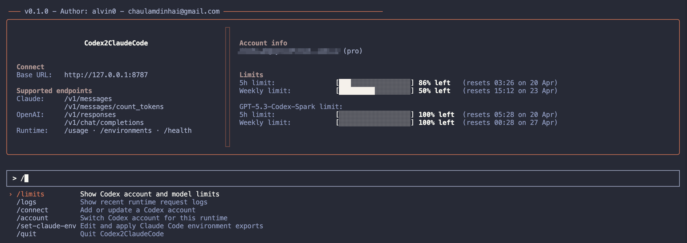

# codex2claudecode

Run OpenAI Codex/ChatGPT account credentials behind a local Claude-compatible API for Claude Code.



## Quick Start

Run with npm:

```sh
npx codex2claudecode
```

Run with Bun:

```sh
bunx codex2claudecode
```

Use a custom port:

```sh
npx codex2claudecode --port 8786
bunx codex2claudecode -p 8786
```

Run without the Ink UI:

```sh
CODEX_NO_UI=1 npx codex2claudecode
```

## Connect an Account

Open the UI and run:

```text
/connect
```

You can choose:

```text
Add from ~/.codex/auth.json
Manual
```

`Add from ~/.codex/auth.json` imports ChatGPT auth from the Codex CLI auth file. Expected shape:

```json
{
  "auth_mode": "chatgpt",
  "tokens": {
    "access_token": "...",
    "refresh_token": "...",
    "account_id": "..."
  }
}
```

`Manual` asks for:

```text
accountId
accessToken
refreshToken
```

Manual mode uses the refresh token to fetch a fresh access token before saving.

## Claude Code

After the server is running, point Claude Code at it:

```sh
export ANTHROPIC_AUTH_TOKEN=""
export ANTHROPIC_BASE_URL="http://127.0.0.1:8787"
export ANTHROPIC_API_KEY=""
export ANTHROPIC_DEFAULT_OPUS_MODEL="gpt-5.4_high"
export ANTHROPIC_DEFAULT_SONNET_MODEL="gpt-5.3-codex_high"
export ANTHROPIC_DEFAULT_HAIKU_MODEL="gpt-5.4-mini_high"
```

The UI command:

```text
/set-claude-env
```

lets you edit the three default model values and echoes the export commands. `ANTHROPIC_BASE_URL` is always generated from the active host/port.

## UI Commands

```text
/connect          Add or update a Codex account
/account          Switch active Codex account
/limits           Show Codex account and model limits
/logs             Show recent runtime request logs
/set-claude-env   Edit Claude Code environment exports
/quit             Quit codex2claudecode
```

## Local API

Default server:

```text
http://127.0.0.1:8787
```

Supported endpoints:

```text
POST /v1/messages
POST /v1/messages/count_tokens
POST /v1/responses
POST /v1/chat/completions
GET  /usage
GET  /environments
GET  /health
```

## Models and Reasoning

GPT-5 models can include a suffix for reasoning effort:

```text
gpt-5.4
gpt-5.4_high
gpt-5.4_xhigh
gpt-5.4-mini_low
```

Suffixes are mapped to the OpenAI Responses `reasoning.effort` field:

```text
none, low, medium, high, xhigh
```

If no suffix is supplied for a GPT-5 model, `medium` is used.

## Storage

By default, codex2claudecode stores data in:

```text
~/.codex2claudecode/
```

Files:

```text
auth-codex.json      OAuth tokens for one or more Codex accounts
.account-info.json   Non-secret account metadata and active account state
.claude-env.json     Saved Claude Code model defaults
```

`auth-codex.json` uses an array:

```json
[
  {
    "type": "oauth",
    "access": "...",
    "refresh": "...",
    "expires": 1777190270176,
    "accountId": "..."
  }
]
```

`.account-info.json` uses account IDs as keys:

```json
{
  "activeAccount": "b444d19b-3e17-4b93-8b78-32111b4e797c",
  "accounts": {
    "b444d19b-3e17-4b93-8b78-32111b4e797c": {
      "email": "you@example.com",
      "plan": "pro",
      "accountId": "b444d19b-3e17-4b93-8b78-32111b4e797c",
      "updatedAt": "2026-04-19T00:00:00.000Z"
    }
  }
}
```

## Environment Variables

```sh
HOST=127.0.0.1
PORT=8787
CODEX_AUTH_FILE=~/.codex2claudecode/auth-codex.json
CODEX_AUTH_ACCOUNT=<accountId>
LOG_BODY=0
CODEX_NO_UI=1
```

CLI `--port` / `-p` takes precedence over `PORT`.

## Development

From this repository:

```sh
cd standalone
bun install
bun run start
bun run start -- --port 8786
bun run check
bun run test
bun run coverage
```

Live smoke test using `auth-codex.json`:

```sh
bun run test:live
```

## Notes

- `auth-codex.json` contains secrets. Do not commit it.
- `.account-info.json` and `.claude-env.json` do not contain OAuth tokens, but may contain email/account metadata.
- Bun currently reports line/function coverage. Branch coverage is covered by deterministic tests but is not reported by Bun text/lcov output.

## Author

alvin0 <chaulamdinhai@gmail.com>
